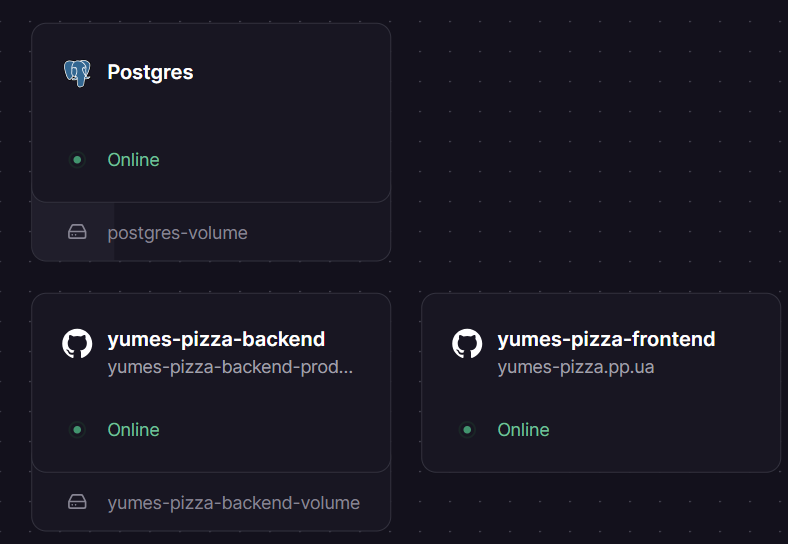
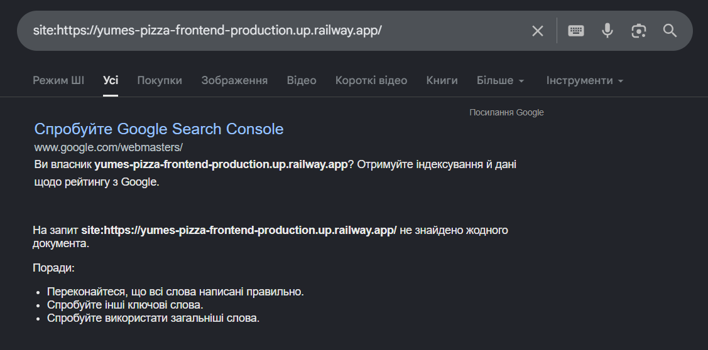

# Лабораторна робота №1. Вступ до SEO та пошукових систем

---

## Мета

Отримати практичний досвід розгортання вебзастосунка в production середовищі, ознайомитись з інструментами вебмайстра
та на власному прикладі побачити як пошукові системи взаємодіють з сайтом.

---

## Команда:
- Атвіновський Олексій: DevOps, TeamLead
- Довгаль Кирило: Frontend Dev
- Оршовський Сергій: Backend Dev

## Завдання

### 1. Підготовка проєкту

Створено проєкт для замовлення та доставки їжі ресторану.

Використані технології:
- **Next.js** (App Router), 
- **Node,js** + Express,
- **PostgreSQL**

```bash
# Запуск бекенду
cd apps/backend
npm install
npm run dev
```

```bash
# Запуск фронтенду
cd apps/frontend
npm install
npm run dev
```

---

### 2. Розгортання на Railway

- Backend: https://yumes-pizza-backend-production.up.railway.app/
- Frontend: https://yumes-pizza-frontend-production.up.railway.app/

Результат деплою:


---

### 3. Реєстрація домену

Домен: https://yumes-pizza.pp.ua/

---

### 4. Підключення домену до Railway

Налаштування Railway:


Налаштування домену:


---

### 5. Дослідження - "Що бачить Google"

Виконати та зафіксувати результати:

**5.1 - curl запит**

```bash
curl curl -s https://yumes-pizza.pp.ua/ > curl-result.html
```
Отриманий HTML у файл:
[html](results/curl-result.html)


**5.2 - Аналіз результату**

Знайти в отриманому HTML та заповнити таблицю:

| Елемент                     | Присутній | Що містить |
|-----------------------------|-----------|------------|
| Текст страв                 | Так       | Назва, ціна, опис |
| `<title>`                   | Так       | Доставка їжі у Чернівцях — піца, бургери, салати | Yumes           |
| `<meta name="description">` | Так       | Yumes — доставка їжі у Чернівцях. Замовляйте піцу, бургери, салати та інші страви з швидкою доставкою додому або в офіс. |
| Вміст `<body>`              | -         | категорії, список товарів |

**5.3 - View Source в браузері**

- Відкрити сайт в браузері
- `ПКМ → View Page Source` (не DevTools, а саме Source)
- Порівняти з результатом curl
- Зафіксувати різницю

**5.4 - Google Cache перевірка**

В пошуку Google ввести:

```
site:your-project.railway.app
```

Зафіксувати - чи знайдено сайт, як виглядає сніпет



---

### 6. Підключення Google Search Console

- Перейти на [search.google.com/search-console](https://search.google.com/search-console)
- Додати ресурс: `Add Property → Domain`
- Обрати верифікацію через **DNS TXT запис**
- GSC надасть запис вигляду:

```
Тип:      TXT
Значення: google-site-verification=xxxxxxxxxxxxx
```

- Додати цей запис на [nic.ua](https://nic.ua) в DNS налаштуваннях домену
- Натиснути "Verify" в GSC
- Зафіксувати скріншот успішної верифікації

> Якщо використовується `*.railway.app` - обрати верифікацію через HTML тег або файл

---

### 7. Перший запит на індексацію

- В GSC перейти до `URL Inspection`
- Ввести головну сторінку свого сайту
- Натиснути `Request Indexing`
- Зафіксувати скріншот

---

### Результати для звіту

Звіт має містити:

```
1. URL розгорнутого сайту на Railway
2. Назва зареєстрованого домену
3. Скріншот успішного deploy на Railway
4. Вміст файлу curl-result.txt з поясненням що ти бачиш
5. Порівняльна таблиця curl vs View Source vs DevTools
6. Скріншот верифікації в Google Search Console
7. Скріншот запиту на індексацію
8. Відповідь на питання: "Що побачить Google crawler на вашому сайті
   і чому це може бути проблемою?"
```

---

## Контрольні питання

### Рівень 1 - Розуміння термінів

1. Що таке SEO і чим відрізняється від платної реклами (SEA)?
2. Поясніть різницю між `crawling`, `indexing` та `ranking`. Наведіть аналогію з реального життя.
3. Що таке DNS і яку роль він відіграє при відкритті веб-сайту?
4. Що таке CNAME запис і чим він відрізняється від A запису?
5. Навіщо потрібен TXT запис у DNS? Які ще завдання він може виконувати крім верифікації GSC?

### Рівень 2 - Аналіз

6. Ви виконали `curl` запит до свого сайту і побачили лише `<div id="root"></div>`. Поясніть чому так відбувається і що
   це означає для пошукових систем.
7. Чим відрізняється `View Page Source` від перегляду DOM у DevTools? Чому це важливо для SEO?
8. Що таке DNS propagation і чому зміни в DNS не застосовуються миттєво?
9. Яка різниця між White, Grey та Black SEO? Наведіть конкретні приклади технік для кожного.
10. Чому Google Search Console вимагає підтвердження власника сайту і які є способи верифікації?

### Рівень 3 - Синтез та висновки

11. На основі результатів лабораторної роботи - чи готовий ваш сайт до індексації? Обґрунтуйте відповідь.
12. Googlebot вміє виконувати JavaScript, але все одно існує проблема з CSR сайтами. Дослідіть та поясніть чому.
13. Запропонуйте три конкретні зміни які можна зробити вже зараз (без переходу на SSR) щоб покращити індексацію CSR
    сайту.
14. Порівняйте два підходи до верифікації в GSC: через DNS TXT та через HTML файл. Які переваги та недоліки кожного?

---

## Критерії оцінювання

| Завдання                               | Балів  |
|----------------------------------------|--------|
| Сайт розгорнутий та доступний публічно | 2      |
| Домен зареєстровано та підключено      | 2      |
| Аналіз curl результату з поясненням    | 2      |
| GSC верифікований та скріншот          | 2      |
| Відповіді на контрольні питання        | 2      |
| **Разом**                              | **10** |
