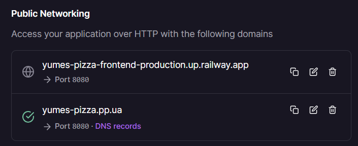
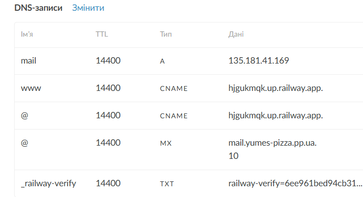
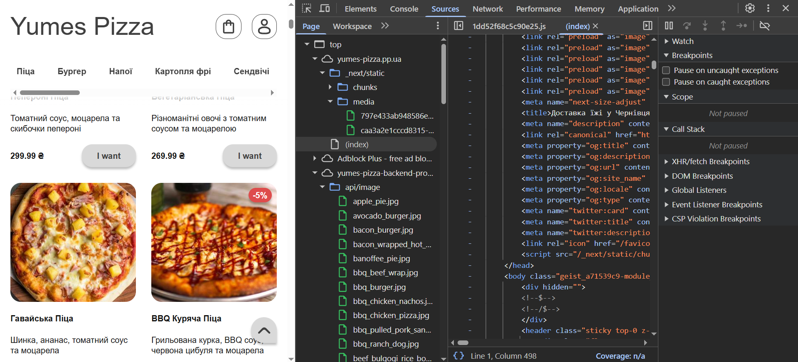
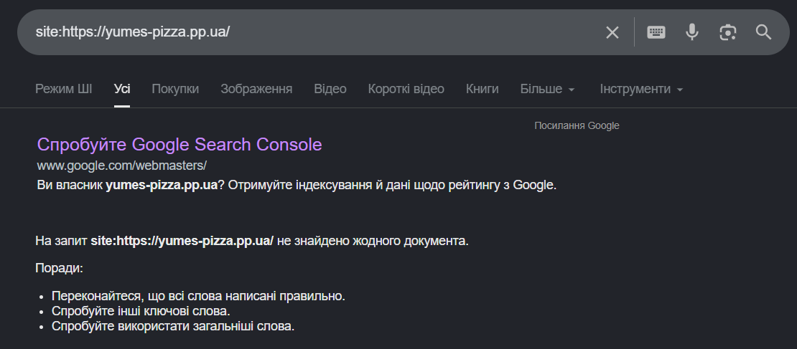
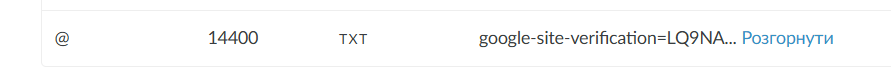
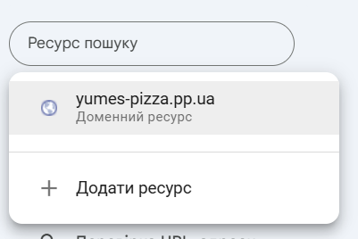
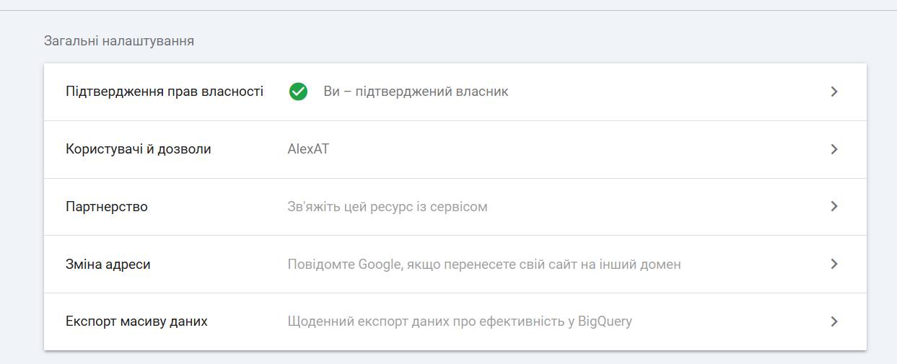
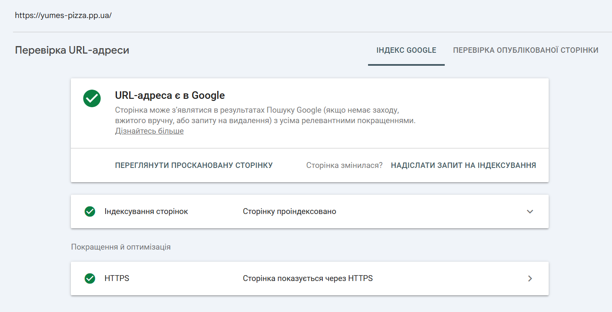

# Звіт: Лабораторна робота №1. Вступ до SEO та пошукових систем

---

## Мета

Отримати практичний досвід розгортання вебзастосунка в production середовищі, ознайомитись з інструментами вебмайстра
та на власному прикладі побачити як пошукові системи взаємодіють з сайтом.

---

## Команда:
- Атвіновський Олексій: DevOps, TeamLead
- Довгаль Кирило: Frontend Dev
- Оршовський Сергій: Backend Dev

## Завдання

### 1. Підготовка проєкту

Створено проєкт для замовлення та доставки їжі ресторану.

Використані технології:
- **Next.js** (App Router), 
- **Node,js** + Express,
- **PostgreSQL**

```bash
# Запуск бекенду
cd apps/backend
npm install
npm run dev
```

```bash
# Запуск фронтенду
cd apps/frontend
npm install
npm run dev
```

---

### 2. Розгортання на Railway

- Backend: https://yumes-pizza-backend-production.up.railway.app/
- Frontend: https://yumes-pizza-frontend-production.up.railway.app/

Результат деплою:


---

### 3. Реєстрація домену

Домен: https://yumes-pizza.pp.ua/

---

### 4. Підключення домену до Railway

Налаштування Railway:



Налаштування домену:



---

### 5. Дослідження - "Що бачить Google"

Виконати та зафіксувати результати:

**5.1 - curl запит**

```bash
curl curl -s https://yumes-pizza.pp.ua/ > curl-result.html
```
Отриманий HTML у файл:

[html](lab1/results/curl-result.html)


**5.2 - Аналіз результату**

Знайти в отриманому HTML та заповнити таблицю:

| Елемент                     | Присутній | Що містить |
|-----------------------------|-----------|------------|
| Текст страв                 | Так       | Назва, ціна, опис |
| `<title>`                   | Так       | Доставка їжі у Чернівцях — піца, бургери, салати | Yumes           |
| `<meta name="description">` | Так       | Yumes — доставка їжі у Чернівцях. Замовляйте піцу, бургери, салати та інші страви з швидкою доставкою додому або в офіс. |
| Вміст `<body>`              | -         | категорії, список товарів |

**5.3 - View Source в браузері**

- Відкрити сайт в браузері
- `ПКМ → View Page Source` (не DevTools, а саме Source)
- Порівняти з результатом curl
- Зафіксувати різницю



Різниця:
Результат curl запиту та View Source ідентичні. Обидва показують HTML який повернув сервер до виконання JS.

**5.4 - Google Cache перевірка**

В пошуку Google ввести:

```
site:your-project.railway.app
```

Зафіксувати - чи знайдено сайт, як виглядає сніпет



---

### 6. Підключення Google Search Console

Додано verification:



Сайт:



Власник:



---

### 7. Перший запит на індексацію

- В GSC перейти до `URL Inspection`
- Ввести головну сторінку свого сайту
- Натиснути `Request Indexing`
- Зафіксувати скріншот




---


---

## Контрольні питання

### РІВЕНЬ 1 — Розуміння термінів

1. **Що таке SEO і чим відрізняється від платної реклами (SEA)?**
SEO (Search Engine Optimization) — це безкоштовне просування сайту в органічній видачі пошукової системи за рахунок оптимізації контенту, структури та посилань. SEA (Search Engine Advertising) — це платна реклама, де ти платиш за кожен клік або показ. SEO дає довгостроковий результат, SEA — миттєвий, але зупиняється як тільки закінчується бюджет.

2. **Поясніть різницю між `crawling`, `indexing` та `ranking`. Наведіть аналогію з реального життя.**
`Crawling` — бот обходить сторінки сайту (як бібліотекар ходить по полицях). 
`Indexing` — зберігає знайдений контент у базу даних (записує книги в каталог). 
`Ranking` — визначає порядок відображення в результатах пошуку (вирішує яку книгу порадити першою).

3. **Що таке DNS і яку роль він відіграє при відкритті веб-сайту?**
DNS (Domain Name System) — це система яка перетворює доменне ім'я (yumes.ua) на IP-адресу сервера. Коли користувач вводить URL, браузер спочатку звертається до DNS щоб дізнатись де знаходиться сайт, і тільки потім підключається до сервера.

4. **Що таке CNAME запис і чим він відрізняється від A запису?**
A запис вказує домен напряму на IP-адресу. CNAME (Canonical Name) вказує домен на інший домен, а не на IP. Наприклад, `www.yumes-pizza.ua` → `yumes-frontend.railway.app`. Це зручно коли IP може змінюватись — достатньо оновити один запис.

5. **Навіщо потрібен TXT запис у DNS? Які ще завдання він може виконувати крім верифікації GSC?**
TXT запис зберігає довільний текст у DNS. Крім верифікації Google Search Console та верифікації Railway він використовується для: налаштування SPF/DKIM (захист від спаму в email), верифікації в інших сервісах (Facebook, Mailchimp), та підтвердження прав власності на домен.

---

### РІВЕНЬ 2 — Аналіз

6. **Ви виконали `curl` запит і побачили лише `<div id="root"></div>`. Поясніть чому так відбувається.**
Це означає що сайт побудований на CSR (Client-Side Rendering) — весь контент генерується JavaScript у браузері. `curl` не виконує JS, тому бачить порожній HTML. Для пошукових систем це проблема — Google crawler може не дочекатись виконання JS і проіндексує порожню сторінку без контенту.

7. **Чим відрізняється `View Page Source` від перегляду DOM у DevTools? Чому це важливо для SEO?**
`View Page Source` показує оригінальний HTML який прийшов від сервера — те саме що бачить Google crawler. DevTools → Elements показує живий DOM після виконання всього JavaScript. Для SEO важливий саме View Source, бо він відображає що реально проіндексує пошуковик.

8. **Що таке DNS propagation і чому зміни в DNS не застосовуються миттєво?**
DNS propagation — це час поширення змін DNS записів по всіх серверах інтернету. DNS записи кешуються на проміжних серверах з певним TTL (Time To Live). Поки кеш не застаріє — сервери віддають старі дані. Зазвичай займає від кількох хвилин до 48 годин.

9. **Яка різниця між White, Grey та Black SEO?**
**White SEO** — легальні методи: якісний контент, правильна структура, отримання природніх посилань.
**Grey SEO** — методи в "сірій зоні": масовий обмін посиланнями, дорвеї, надмірне використання ключових слів.
**Black SEO** — заборонені методи: прихований текст, куплені посилання, клоакінг (показ різного контенту боту і користувачу). Призводить до бану сайту.

10. **Чому Google Search Console вимагає підтвердження власника сайту і які є способи верифікації?**
Щоб захистити власників від несанкціонованого доступу до даних та керування індексацією. Способи верифікації: HTML файл на сервері, meta тег у `<head>`, DNS TXT запис, Google Analytics, Google Tag Manager.

---

### РІВЕНЬ 3 — Синтез та висновки

11. **На основі результатів лабораторної роботи — чи готовий ваш сайт до індексації?**
Частково готовий. SSR працює коректно — `curl` показав повноцінний HTML з `<title>`, `<meta description>` та всім контентом. Ще потрібно протестувати кожну окрему сторінку та оптимізувати її під SEO. Google Search Console підключено і запит на індексацію подано.

12. **Googlebot вміє виконувати JavaScript, але все одно існує проблема з CSR сайтами. Поясніть чому.**
Googlebot рендерить JS у два етапи: спочатку індексує HTML, потім ставить сторінку в чергу на рендеринг з JS. Черга може займати дні або тижні. Крім того є ліміт ресурсів — бот не чекає нескінченно на завантаження. Контент який з'являється після JS може бути проіндексований із великою затримкою або не проіндексований взагалі.

13. **Три конкретні зміни для покращення індексації CSR сайту без переходу на SSR:**
**1. Pre-rendering** — використати сервіс типу Prerender.io який рендерить сторінки для ботів і віддає готовий HTML.
**2. Static HTML fallback** — додати базовий HTML з ключовим контентом напряму в `index.html` щоб бот одразу бачив щось змістовне.
**3. Sitemap + robots.txt** — додати `sitemap.xml` з усіма URL і правильно налаштувати `robots.txt` щоб допомогти боту знайти всі сторінки.

14. **Порівняйте верифікацію через DNS TXT та HTML файл.**

| | DNS TXT | HTML файл |
|---|---|---|
| **Переваги** | Не залежить від коду сайту, залишається навіть при редеплої | Простіше налаштувати, не потрібен доступ до DNS |
| **Недоліки** | Потрібен доступ до DNS провайдера, DNS propagation до 48 годин | Файл може зникнути при редеплої, залежить від доступності сервера |

Для довгострокового використання краще DNS TXT — він надійніший і не залежить від змін у коді.
