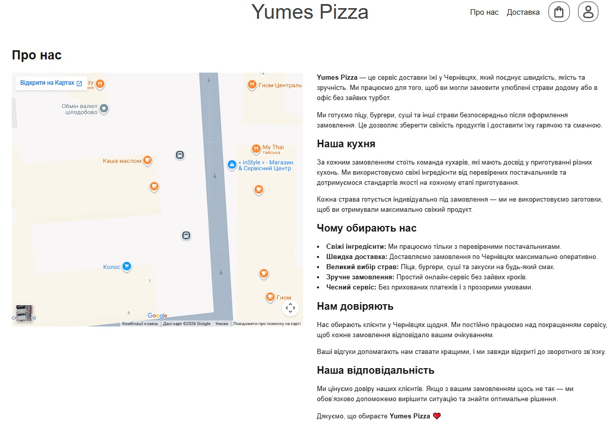
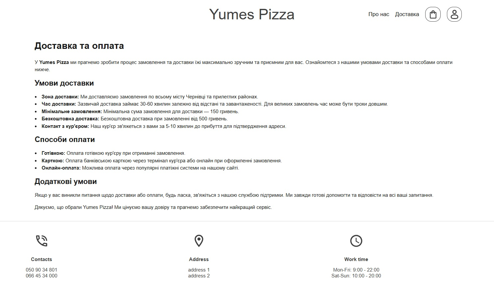
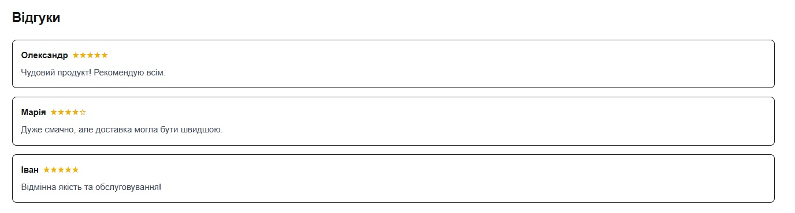
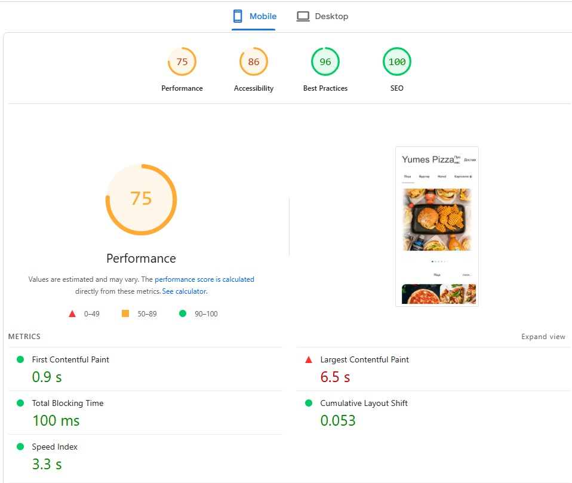
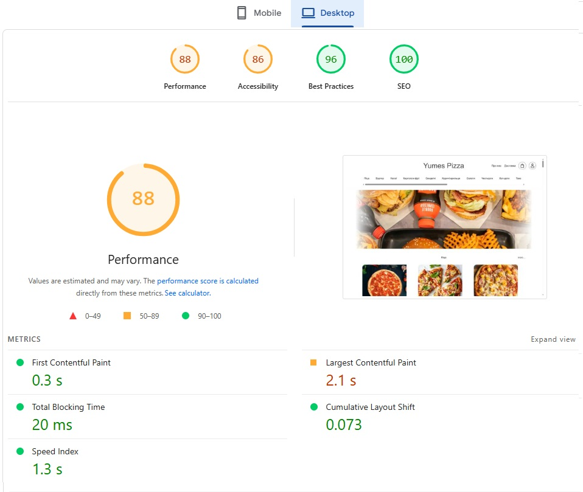

# Звіт: Лабораторна робота №2. Індексація та алгоритми Google

---

## Мета

Навчитись перевіряти стан індексації сайту через Google Search Console, зрозуміти статуси
Coverage Report, впровадити E-E-A-T-сигнали у власний проєкт та отримати базовий Lighthouse звіт як точку відліку для
подальшої оптимізації.

---

## Команда:
- Атвіновський Олексій: DevOps, TeamLead
- Довгаль Кирило: Frontend Dev
- Оршовський Сергій: Backend Dev

---

## Завдання

### 1. Перевірка поточного стану індексації

#### 1.1 - URL Inspection у GSC

- Відкрити [Google Search Console](https://search.google.com/search-console)
- Перейти до інструменту `URL Inspection`
- Перевірити головну сторінку сайту
- Зафіксувати у звіті:

| Параметр                           | Значення |
|------------------------------------|----------|
| Статус індексації                  |          |
| Дата останнього crawl              |          |
| Метод виявлення URL                |          |
| Чи дозволено індексацію robots.txt |          |
| Чи є canonical                     |          |
| Статус рендерингу (screenshot)     |          |

- Зробити скріншот вкладки **"Coverage"** та **"Enhancements"**

#### 1.2 - Перевірка через пошукові оператори

Виконати наступні запити в Google та зафіксувати результати:

```
site:ваш-домен.pp.ua
cache:ваш-домен.pp.ua
info:ваш-домен.pp.ua
```

| Оператор | Результат | Що це означає |
|----------|-----------|---------------|
| site:    |           | Використовується для перевірки індексації сайту (які сторінки є в Google) |
| cache:   |           | Дає можливість побачити, як сторінка виглядала під час останнього сканування Google |
| info:    |           | Дає загальну інформацію про сторінку в пошуковій системі (індексація, кеш, схожі сторінки) |

> **Очікуваний результат:** сайт може ще не з'явитись у результатах - це нормально для нового домену. Важливо
> зафіксувати поточний стан і розуміти чому так відбувається.

#### 1.3 - Аналіз статусів Coverage Report

Нижче наведено типові статуси які можна побачити у GSC Coverage Report. Для кожного статусу - напишіть пояснення своїми
словами та вкажіть можливу причину:

| Статус                                 | Пояснення | Можлива причина |
|----------------------------------------|-----------|-----------------|
| **Submitted and indexed**              | Сторінка успішно додана в індекс і може з’являтися в пошуку | Все працює правильно, сторінка доступна і не має обмежень |
| **Crawled - currently not indexed**    | Сторінку просканували, але поки не додали в індекс | Низька якість контенту, дублікат, або Google вирішив, що сторінка неважлива |
| **Discovered - currently not indexed** | Google знає про сторінку, але ще не відвідував її | Новий сайт, мало ресурсів crawl budget або мало внутрішніх/зовнішніх посилань |
| **Excluded by noindex tag**            | Сторінка має тег `noindex`, тому не додається в пошук | Спеціально встановлений meta-тег `noindex` або HTTP-заголовок |
| **Blocked by robots.txt**              | Сторінка заблокована для сканування через robots.txt | У файлі robots.txt заборонено доступ до цієї сторінки |
| **Redirect error**                     | Помилка при перенаправленні сторінки | Неправильний редірект, цикл редіректів або битий URL |
| **404 Not Found**                      | Сторінка не існує | Неправильне посилання або сторінку видалили |
| **Soft 404**                           | Сторінка виглядає як існуюча, але фактично порожня або без корисного контенту | Порожня сторінка, сторінка з текстом "нічого не знайдено" без правильного статусу 404 |

> [Документація GSC](https://support.google.com/webmasters/answer/7440203) для дослідження кожного статусу

---

### 2. Аналіз алгоритмів Google на реальних прикладах

Для кожного алгоритму знайти реальний кейс (новина, кейс-стаді, форум) де сайт постраждав або виграв після оновлення.
Заповніть таблицю:

| Алгоритм    | Рік запуску | На що впливає | Реальний кейс (посилання) | Що треба робити |
|-------------|-------------|---------------|---------------------------|-----------------|
| **Panda**   | 2011        | Якість контенту (дублі, "thin content") | https://www.searchenginewatch.com/2013/08/07/google-panda-penguin-phantom-3-recovery-examples/ | Писати унікальний, корисний контент, прибрати дублікати та "тонкі" сторінки |
| **Penguin** | 2012        | Посилання (спамні беклінки, куплені лінки) | https://www.linkbuildr.com/google-penguin-recovery-case-study/ | Видалити або disavow неякісні лінки, не купувати посилання |
| **BERT**    | 2019        | Розуміння запитів (контекст, природна мова) | https://www.searchenginejournal.com/google-bert-update/324520/ | Писати для людей, відповідати на запити природною мовою, фокус на сенсі |

- Який з цих алгоритмів найбільш релевантний для вашого сайту? Чому?
- Як BERT змінив підхід до написання контенту порівняно з Panda?

---

### 3. Впровадження E-E-A-T у проєкт

E-E-A-T (Experience, Expertise, Authoritativeness, Trustworthiness) — це набір сигналів, за якими Google оцінює якість та надійність сайту.

Завдання: впровадити E-E-A-T елементи для сайту доставки їжі **Yumes Pizza**.

---

#### 3.1 — Сторінка "Про нас" `/about`

Створити та наповнити сторінку `/about`, яка містить:

- Назва сервісу (**Yumes Pizza**) та опис:
  - доставка їжі у Чернівцях
  - піца, суші, бургери та інші страви
- Коротка історія:
  - коли створений сервіс
  - скільки років працює
- Опис кухні:
  - страви готуються після оформлення замовлення
  - використовуються свіжі інгредієнти
- Інформація про команду:
  - кухарі або шеф
  - досвід у приготуванні
- Місія:
  - швидка доставка + якість
- Фото:
  - кухня
  - процес приготування
  - команда
- Соціальні мережі:
  - Instagram
  - Facebook
- Контактна інформація:
  - телефон або кнопка зв’язку



---

#### 3.2 — Сторінка "Доставка та оплата" `/delivery`

Переконатись що сторінка `/delivery` містить:

- Зона доставки (Чернівці та прилеглі райони)
- Час доставки (наприклад 30–60 хв)
- Мінімальне замовлення
- Умови безкоштовної доставки
- Способи оплати:
  - готівка
  - картка
  - онлайн-оплата
- Додаткові умови:
  - що робити при затримці доставки
  - що робити при помилці в замовленні



---

#### 3.3 — Сторінки страв `/product/[slug]`

Для кожної страви реалізувати:

- Назва страви
- Реальне фото (не стокове)
- Опис
- Склад інгредієнтів
- Вага / розмір
- Ціна
- Відгуки клієнтів


---

#### 3.4 — Відгуки

Реалізувати:

- Відгуки на сторінках страв

Відгуки повинні містити:
- ім’я клієнта
- текст відгуку



---

#### 3.5 — E-E-A-T чек-ліст

**Experience (Досвід)**

- Страви готуються після замовлення
- Є реальні фото їжі
- Є відгуки клієнтів

**Expertise (Експертиза)**

- Вказано досвід кухарів або команди
- Є опис інгредієнтів і процесу приготування

**Authoritativeness (Авторитетність)**

- Є сторінка `/about`
- Є відгуки клієнтів

**Trustworthiness (Надійність)**

- Сайт працює через HTTPS
- Є контакти в footer
- Є телефон та адреса
- Є Google Maps
- Є прозорі умови доставки `/delivery`
- Є способи оплати
- Є гарантія вирішення проблем із замовленням

### 4. Базовий Lighthouse звіт

Цей крок фіксує **поточний стан** продуктивності сайту до будь-якої оптимізації. Ці дані будуть точкою порівняння в
майбутніх лабораторних.

#### 4.1 - Запустити PageSpeed Insights

- Перейти на [pagespeed.web.dev](https://pagespeed.web.dev)
- Ввести URL головної сторінки сайту
- Запустити аналіз для **Mobile** та **Desktop**

Результати: https://pagespeed.web.dev/analysis/https-yumes-pizza-pp-ua/p2r5e7n0dh?form_factor=mobile

Результат Mobile:



Результат Desktop:



#### 4.2 - Зафіксувати показники

| Метрика                             | Mobile | Desktop |
|-------------------------------------|--------|---------|
| Performance Score                   |   75   |   88    |
| SEO Score                           |   100  |   100   |
| Accessibility Score                 |   86   |   86    |
| Best Practices Score                |   96   |   96    |
| **LCP** (Largest Contentful Paint)  |  6.5 s |  2.1 s  |
| **CLS** (Cumulative Layout Shift)   |  0.053 |  0.073  |
| **INP** (Interaction to Next Paint) |        |         |
| **FCP** (First Contentful Paint)    |  0.9 s |  0.3 s  |
| **TTFB** (Time to First Byte)       |  0 ms  |  0 ms   |

#### 4.3 - Аналіз результатів

У звіті відповісти на питання:

### 1. Які метрики у червоній зоні? Що це означає для користувача?
- 🔴 **LCP (6.5s на Mobile)**  
  Це означає, що основний контент сторінки завантажується дуже довго.  
  Користувач бачить "порожній" екран або довго чекає → може піти з сайту.

---

### 2. Які три проблеми PageSpeed вважає найкритичнішими?
1. Повільний **LCP** (великий або неоптимізований головний елемент)
2. Великі зображення без оптимізації (формат, розмір)
3. Ресурси, що блокують рендеринг (JS/CSS)

---

### 3. Порівняй результати Mobile vs Desktop - чому вони відрізняються?
- Mobile гірший (75 vs 88), бо:
  - слабші пристрої (менше CPU)
  - повільніший інтернет
  - більша залежність від оптимізації зображень
- Desktop кращий, бо:
  - потужніше залізо
  - швидше завантаження ресурсів

---

### Результати для звіту

```
1. Скріншот URL Inspection з GSC (головна сторінка)
2. Результати site:, cache:, info: операторів
3. Заповнена таблиця статусів Coverage Report з поясненнями
4. Таблиця алгоритмів Google з реальними кейсами
5. Скріншот сторінки /about
6. Скріншот профілю автора на сторінці статті
7. Заповнений E-E-A-T  чек-ліст
8. Скріншоти PageSpeed Insights (Mobile + Desktop)
9. Заповнена таблиця Lighthouse метрик
10. Аналіз результатів Lighthouse
```

---

## Контрольні питання

### Рівень 1 - Розуміння термінів

1. Що означає статус "Discovered - currently not indexed" і чому Google може не індексувати сторінку навіть якщо знайшов
   її?
2. Яка різниця між `crawling` та `indexing`? Чи може сторінка бути crawled, але не indexed?
3. Що таке "crawl budget" і чому він важливий для великих сайтів?
4. Поясніть що означає кожна літера в абревіатурі E-E-A-T.
5. Що таке LCP, CLS та INP? Які порогові значення вважаються "оптимальними"?

### Рівень 2 - Аналіз

6. Алгоритм Panda карає за "thin content". Наведіть три приклади thin content який міг би з'явитись на вашому сайті та
   пояснити як його уникнути.
7. Чому алгоритм BERT змінив підхід до keyword stuffing? Як він аналізує текст інакше ніж попередні алгоритми?
8. Ваш сайт отримав низький Performance Score на мобільному пристрої. Назвіть три найпоширеніші причини цього і як їх
   виправити.
9. Чому Google надає перевагу сайтам з чітко вираженим авторством? Як це пов'язано з алгоритмом Helpful Content?
10. Що таке "Soft 404" і чим він небезпечніший за звичайний 404 з точки зору SEO?

### Рівень 3 - Синтез та висновки

11. Проаналізуйте свій E-E-A-T чек-ліст. Які три найслабші місця вашого проекту з точки зору E-E-A-T? Запропонуйте план
    покращення.
12. Уявіть, що після оновлення Helpful Content ваш сайт втратив 40% трафіку. Які кроки ви зробите для діагностики та
    відновлення позицій?
13. Порівняйте Lighthouse показники вашого сайту з показниками відомого IT-блогу, порталу тощо (наприклад css-tricks.com
    або dev.to). Що
    відрізняється і чому?
14. Які з Core Web Vitals метрик безпосередньо впливають на ранжування в Google і які лише рекомендовані? Знайдіть
    офіційне підтвердження вашої відповіді.

---

## Критерії оцінювання

| Завдання                               | Балів  |
|----------------------------------------|--------|
| URL Inspection + таблиця параметрів    | 1      |
| Аналіз Coverage Report статусів        | 2      |
| Таблиця алгоритмів з реальними кейсами | 2      |
| Сторінка /about створена та наповнена  | 1      |
| Профіль автора на сторінці статті      | 1      |
| E-E-A-T чек-ліст заповнений            | 1      |
| Lighthouse звіт + аналіз               | 2      |
| **Разом**                              | **10** |
