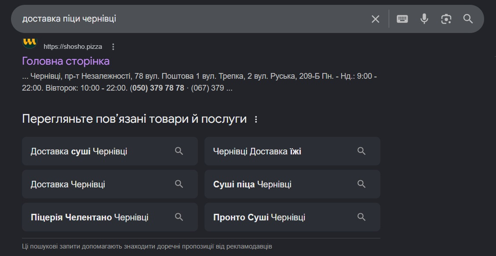
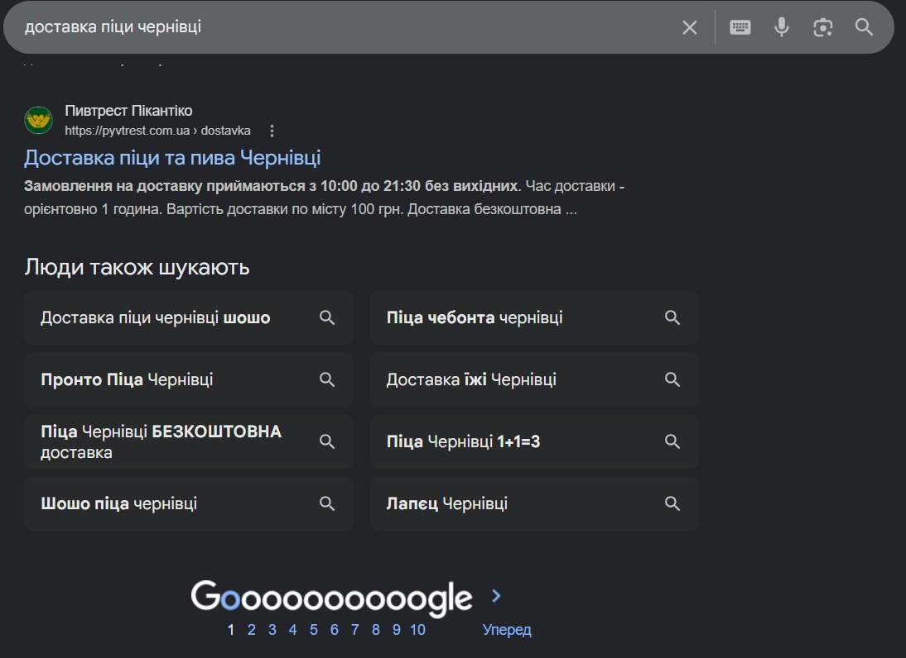
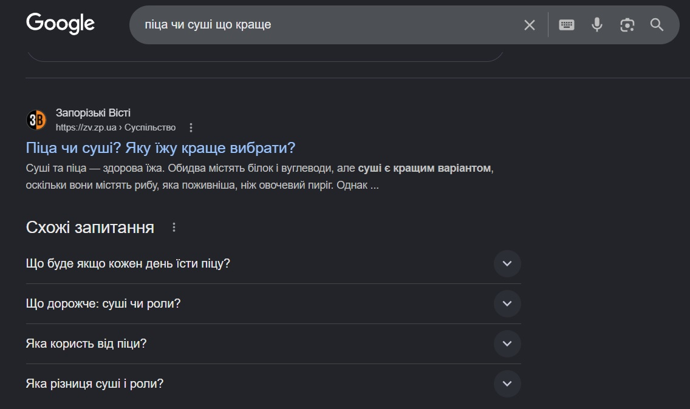
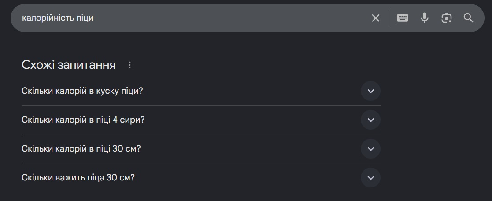
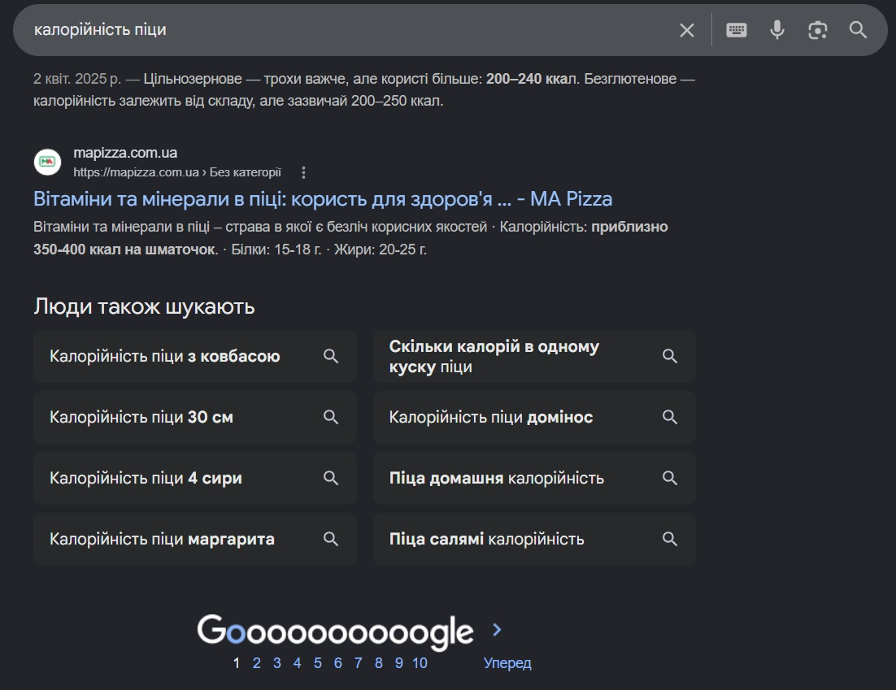
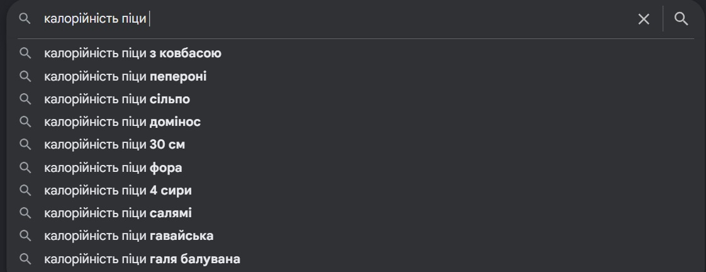
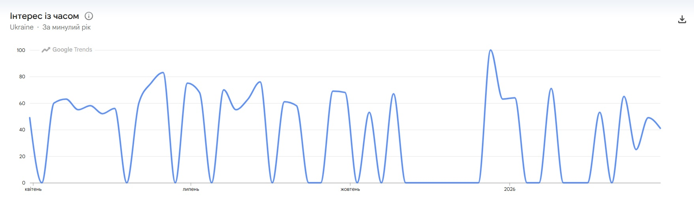
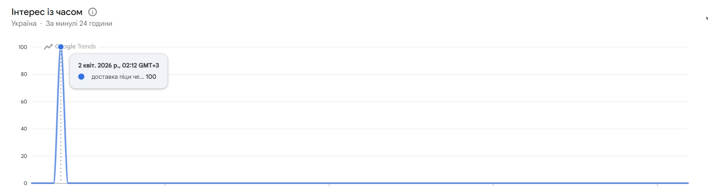
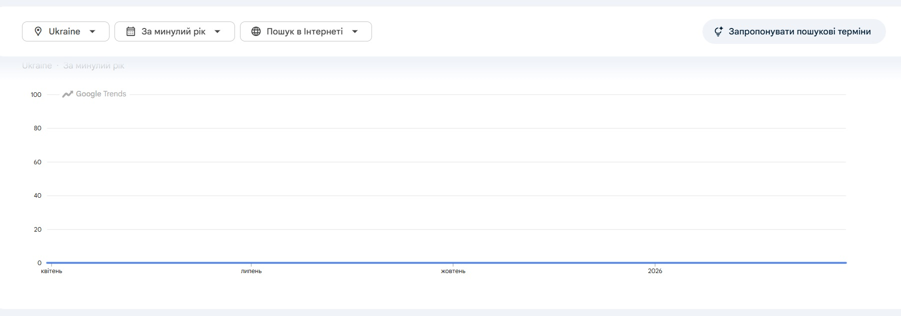
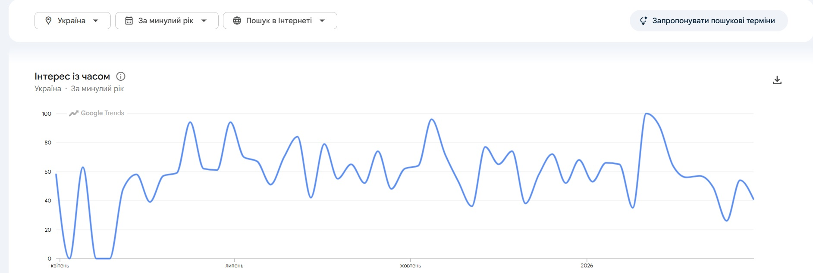

# Звіт: Лабораторна робота №3. Семантичне ядро та структура сайту

---

## Мета

Навчитись збирати та класифікувати ключові слова за типом пошукового інтенту, будувати семантичне ядро у структурованому
форматі, кластеризувати запити та проектувати silo-структуру сайту на основі зібраних даних.

---

## Команда:
- Атвіновський Олексій: DevOps, TeamLead
- Довгаль Кирило: Frontend Dev
- Оршовський Сергій: Backend Dev

---

## Інструменти

| Інструмент             | Для чого                             | Посилання                                            |
|------------------------|--------------------------------------|------------------------------------------------------|
| Google Search          | Autocomplete, People also ask        | google.com                                           |
| Google Trends          | Порівняння частотності та сезонність | trends.google.com                                    |
| Google Keyword Planner | Частотність та конкурентність        | ads.google.com/intl/uk_ua/home/tools/keyword-planner |
| Google Sheets          | Таблиця семантичного ядра            | sheets.google.com                                    |

---

## Завдання

### 1. Класифікація типів пошукових запитів

#### 1.1 - Теоретична база

Перед початком роботи розібратися з типами пошукового інтенту (search intent):

| Тип               | Опис                     | Приклад запиту               | Яка сторінка відповідає    |
|-------------------|--------------------------|------------------------------|----------------------------|
| **Informational** | Хоче дізнатись           | "що таке react hooks"        | Стаття, туторіал           |
| **Navigational**  | Шукає конкретний сайт    | "github login"               | Головна, про нас           |
| **Transactional** | Хоче щось зробити/купити | "завантажити vs code"        | Лендінг, сторінка продукту |
| **Commercial**    | Порівнює перед рішенням  | "next.js vs nuxt порівняння" | Порівняльна стаття         |

#### 1.2 - Практичне завдання

Для обраної тематики проєкту (IT блог або обраний проект тощо) придумати та класифікувати **20 пошукових запитів**.
Заповнити у Google
Sheets:
https://docs.google.com/spreadsheets/d/19W536VCV24nXlLnkevsbIrEipr9Cal6Hp_h000uLucM/edit?usp=sharing

**Вимога:** мінімум по 4 запити кожного типу.

#### 1.3 - Аналіз через Google Search

Для 3 запитів з таблиці виконати в Google:

- Подивитись блок **"People also ask"** - зафіксувати 3-5 питань
- Подивитись блок **"Related searches"** внизу сторінки
- Звернути увагу на **autocomplete** при введенні запиту

Додати знайдені запити до таблиці якщо вони релевантні.

---

**1. Запит "доставка піци чернівці"**
 - блок **"People also ask"**: відсутній
 - блок **"Related searches"**:





 - **autocomplete**:


---

**2. Запит "піца чи суші що краще"**
 - блок **"People also ask"**: 



 - блок **"Related searches"**: відсутній
 - **autocomplete**:


---

**3. Запит "калорійність піци"**
 - блок **"People also ask"**: 



 - блок **"Related searches"**:



 - **autocomplete**:



---

### 2. Збір семантичного ядра

#### 2.1 - Структура таблиці

Створити Google Sheets файл з назвою `semantic-core-[назва-блогу]` та наступними колонками:

| Колонка         | Опис                                | Приклад                  |
|-----------------|-------------------------------------|--------------------------|
| **keyword**     | Ключовий запит                      | "javascript async await" |
| **intent**      | Тип інтенту                         | informational            |
| **volume**      | Середньомісячна частотність         | 1000-10000               |
| **competition** | Конкурентність (Low/Medium/High)    | Low                      |
| **cluster**     | Назва кластеру                      | javascript-basics        |
| **target_page** | URL сторінки яка буде під цей запит | /categories/javascript   |
| **priority**    | Пріоритет (1-3)                     | 1                        |
| **notes**       | Нотатки                             | сезонний запит           |

#### 2.2 - Збір через Google Keyword Planner

https://docs.google.com/spreadsheets/d/19W536VCV24nXlLnkevsbIrEipr9Cal6Hp_h000uLucM/edit?gid=2020215387#gid=2020215387

#### 2.3 - Розширення через Google Trends

Пошук: "піца чернівці"
Висновок: стабільний попит влітку (червень–серпень), різкий пік у грудні (свята), у деякі весняні та осінні тижні низький попит
Графік (рік):



Пошук: "доставка піци чернівці"
Висновок: попит концентрується у пізній вечір (≈23:00), низька активність у денний час. Та зазвичай шукають без слова "доставка", якщо дивитись на річний результат
Результат (тиждень):



Результат (рік):



Пошук: "доставка піци"
Результат: якщо не уточнювати місто, то результати показують краще, оскільки запит тепер не локальний



---

### 3. Кластеризація запитів

| cluster          | Кількість запитів | Головний запит (head keyword)           | Тип сторінки       | Пріоритет |
|-----------------|------------------|----------------------------------------|------------------|-----------|
| pizza           | 14               | піца чернівці                           | /category/pizza   | 1         |
| food-delivery   | 10               | доставка їжі чернівці                   | /delivery         | 1         |
| sushi           | 9                | суші чернівці                           | /category/sushi   | 1         |
| fastfood        | 9                | фастфуд чернівці                        | /                 | 3         |
| special-offers  | 3                | безкоштовна доставка їжі чернівці       | /                 | 2         |
| late-night      | 3                | сервіси доставки                        | /                 | 2         |

---

### 4. Побудова Silo-структури сайту

Silo-структура - це архітектура сайту де сторінки організовані в тематичні силоси (вертикалі), кожен з яких повністю
присвячений одній темі. Внутрішні посилання йдуть всередині силосу і підсилюють його тематичний авторитет.

#### 4.1 - Структура сайту доставки їжі (Yumes)

На основі своїх кластерів побудувати silo-структуру. Шаблон для заповнення - окремий аркуш **"Site Structure"** у Google
Sheets:

**Рівень 0 - Головна**

| URL | Назва сторінки | Тип  | Head keyword              | Опис                                      |
|-----|----------------|------|---------------------------|-------------------------------------------|
| `/` | Головна        | home | "доставка їжі чернівці"   | Меню, популярні страви, акції             |

**Рівень 1 - Категорії (силоси)**

| URL                  | Назва    | Тип      | Head keyword             | Пов'язані категорії |
|----------------------|----------|----------|--------------------------|---------------------|
| `/category/pizza`    | Піца     | category | "піца чернівці"          |                     |
| `/category/sushi`    | Суші     | category | "суші чернівці"          |                     |
| `/category/drinks`   | Напої    | category | "напої доставка"         |                     |
| ...                  |          |          |                          |                     |

**Рівень 2 - Продукти всередині силосу**

| URL                     | Назва продукту | Категорія | Target keyword         | Посилається на      | Отримує посилання від |
|-------------------------|----------------|-----------|------------------------|---------------------|-----------------------|
| `/category/pizza/margarita` | Маргарита    | pizza    | "піца маргарита"      | /category/pizza    | /                     |
| `/category/pizza/pepperoni` | Пепероні     | pizza    | "піца пепероні"       | /category/pizza    | /                     |
| `/category/sushi/california-roll` | Каліфорнійський Рол | sushi | "каліфорнійський рол" | /category/sushi    | /                     |
| `/category/sushi/philadelphia-roll` | Філадельфія Рол | sushi | "філадельфія рол"     | /category/sushi    | /                     |
| `/category/burger/cheeseburger` | Чізбургер   | burger  | "чізбургер"           | /category/burger   | /                     |
| `/category/drinks/cola` | Кола         | drinks  | "кола доставка"       | /category/drinks   | /                     |
| `/category/salads/caesar-salad` | Цезар Салат | salads  | "цезар салат"         | /category/salads   | /                     |
| `/category/desserts/chocolate-brownie` | Шоколадний Брауні | desserts | "шоколадний брауні" | /category/desserts | /                     |
| ...                     |                |           |                        |                     |                       |

**Рівень 3 - Допоміжні сторінки**

| URL              | Назва         | Тип        |
|------------------|---------------|------------|
| `/about`         | Про нас       | static     |
| `/delivery`      | Доставка      | static     |
| `/profile`       | Профіль       | dynamic    |
| `/cart`          | Кошик         | functional |
| `/cart/checkout` | Оформлення    | functional |

#### 4.2 - Схема внутрішніх посилань

На аркуші **"Internal Links"** описати логіку перелінковки:

| Звідки            | Куди                     | Тип посилання | Анкор текст              |
|-------------------|--------------------------|---------------|--------------------------|
| `/`               | `/category/pizza`        | contextual    | "замовити піцу"          |
| `/`               | `/category/sushi`        | contextual    | "замовити суші"          |
| `/`               | `/category/burger`       | contextual    | "замовити бургер"        |
| `/category/pizza` | `/category/pizza/margarita` | contextual | "переглянути маргариту" |
| `/category/sushi` | `/category/sushi/california-roll` | contextual | "переглянути каліфорнійський рол" |
| `/category/pizza/margarita` | `/cart`             | action        | "додати в кошик"         |
| `/category/sushi/california-roll` | `/cart`         | action        | "додати в кошик"         |
| `/cart`           | `/cart/checkout`         | action        | "оформити замовлення"    |
| `/cart/checkout`  | `/delivery`              | info          | "умови доставки"         |
| `/cart/checkout`  | `/profile`               | info          | "вхід до профілю"        |
| `/profile`        | `/profile/sign-in`       | action        | "увійти"                 |
| `/about`          | `/delivery`              | related       | "доставка"               |
| `/category/pizza` | `/`                      | breadcrumb    | "головна"                |
| `/category/pizza/margarita` | `/category/pizza` | breadcrumb | "піца"                   |

**Пояснення типів посилань:**

- **Contextual (контекстні)**: Посилання, що ведуть до релевантного контенту в межах теми сторінки. Наприклад, з головної на категорії їжі, щоб користувач міг продовжити навігацію по меню.
- **Action (дії)**: Посилання, що ініціюють дії користувача, такі як додавання до кошика, оформлення замовлення або вхід до системи. Вони спрямовані на конверсію.
- **Info (інформаційні)**: Посилання на додаткову інформацію, що допомагає користувачу прийняти рішення, наприклад, умови доставки або профіль користувача.
- **Related (пов'язані)**: Посилання на схожий або супутній контент, що покращує користувацький досвід, наприклад, з "Про нас" на "Доставка".
- **Breadcrumb (хлібні крихти)**: Навігаційні посилання, що показують шлях користувача на сайті, допомагаючи повернутися на попередні рівні (наприклад, з продукту на категорію).

**Мінімальна вимога:** описати не менше **10 внутрішніх посилань**.

#### 4.3 - Перевірка структури

Відповісти на контрольні питання щодо своєї структури:

1. **Чи кожна категорія є окремим тематичним силосом?**  
   Так, кожна категорія (піца, суші, бургери, напої тощо) є окремим силосом, присвяченим певному типу їжі, що підсилює тематичний авторитет.

2. **Чи є перехресні посилання між різними силосами? (якщо є - чи виправдані вони?)**  
   Перехресні посилання мінімальні: з головної на всі категорії для зручності навігації. Всередині силосів посилання тільки в межах теми. Це виправдано для покращення UX, але не розмиває авторитет.

3. **Яка максимальна глибина кліків від головної до будь-якого продукту? (має бути не більше 3)**  
   Максимальна глибина - 2 кліки: Головна → Категорія → Продукт. Це забезпечує швидкий доступ до контенту.

4. **Чи є orphan pages - сторінки без жодного вхідного посилання?**  
   Orphan pages відсутні: всі сторінки (категорії, продукти, допоміжні) мають вхідні посилання з головної або з інших сторінок силосу.

---

### Результати для звіту

```
1. Google Sheets файл з 4 аркушами:
   - "Keywords"    - семантичне ядро (мін. 40 запитів)
   - "Clusters"    - зведена таблиця кластерів (мін. 6 кластерів)
   - "Structure"   - silo-структура (всі рівні)
   - "InternalLinks" - схема перелінковки (мін. 10 посилань)

2. Скріншот Google Keyword Planner з результатами пошуку
3. Скріншот Google Trends з порівнянням 2-3 запитів
4. Відповіді на 4 контрольних питання щодо структури (п.4.3)
```

> Надати посилання на Google Sheets з доступом "Переглядати для всіх хто має посилання"

---

## Контрольні питання

### Рівень 1 - Розуміння термінів

1. **Що таке пошуковий інтент і чому Google надає йому пріоритет над точним входженням ключового слова?**  
   Пошуковий інтент - це мета користувача за запитом. Google пріоритетізує його, бо хоче дати корисні результати, а не просто збіги слів.

2. **Яка різниця між head keywords, mid-tail та long-tail запитами? Наведіть приклади для IT тематики.**  
   Head - короткі, висококонкурентні ("піца"); mid-tail - середні ("доставка піци чернівці"); long-tail - довгі, специфічні ("калорійність маргарити в чернівцях").

3. **Що таке семантичне ядро і чим воно відрізняється від простого списку ключових слів?**  
   Семантичне ядро - структурований набір запитів з інтентом, кластерами та пріоритетами. Відрізняється від списку тим, що враховує контекст і стратегію.

4. **Поясніть концепцію silo-структури. Чому Google краще ранжує сайти з чіткою тематичною структурою?**  
   Silo-структура - організація контенту в тематичні силоси з внутрішніми посиланнями. Google краще ранжує, бо це покращує релевантність і передачу авторитету.

5. **Що таке канібалізація ключових слів і як вона шкодить SEO?**  
   Канібалізація - коли кілька сторінок борються за один запит. Шкодить, бо розмиває авторитет і плутає пошуковиків.

### Рівень 2 - Аналіз

1. **У вашому семантичному ядрі є запити з високою частотністю (High volume) та високою конкурентністю (High competition). Чи варто молодому сайту одразу на них орієнтуватись? Обґрунтуйте стратегію.**  
   Не варто одразу: почати з mid-tail і long-tail для швидшого ранжування, потім переходити до head. Стратегія: фокус на ніші, як "доставка їжі чернівці".

2. **Два запити: "як встановити node.js" та "node.js download". Це один кластер чи різні? Поясніть через призму пошукового інтенту.**  
   Різні кластери: перший - informational (навчання), другий - transactional (завантаження). Інтент різний, тому окремі сторінки.

3. **Подивитись на топ-10 результатів Google для головного запиту свого блогу. Які типи сторінок там представлені? Що це говорить про інтент?**  
   Для "доставка їжі чернівці": сайти доставки, меню, контакти. Інтент transactional - користувачі хочуть замовити.

4. **Чому silo-структура передбачає мінімальну кількість посилань між різними силосами? Як це впливає на передачу PageRank?**  
   Щоб зберегти тематичний авторитет силосів. PageRank передається ефективніше всередині теми, покращуючи ранжування релевантних сторінок.

5. **Як Google Trends може допомогти у плануванні контент-календаря блогу? Наведіть конкретний приклад для IT тематики.**  
   Показує сезонність. Наприклад, пік запитів про "доставка на свята" взимку - планувати акції тоді.

### Рівень 3 - Синтез та висновки

1. **Порівняйте структуру свого сайту зі структурою відомого IT блогу (наприклад dev.to, dou.ua, css-tricks.com, smashingmagazine.com). Які відмінності ви бачите і що б запозичили?**  
   Наш сайт - e-commerce з силосами за їжею, на відміну від блогів з статтями. Запозичив би їхню навігацію та внутрішні посилання для кращого UX.

2. **Уявіть що ваш блог має 50 статей без семантичного ядра - просто те що здалось цікавим. Які SEO проблеми це може спричинити? Як це виправити?**  
   Проблеми: низький трафік, погане ранжування, канібалізація. Виправити: створити семантичне ядро, переструктурувати контент у силоси.

3. **Як зміниться семантичне ядро якщо блог вирішить охопити не тільки україномовну, але й англомовну аудиторію? Що технічно треба змінити на сайті?**  
   Додати англомовні запити, кластери. Технічно: hreflang теги, окремі URL або субдомени для мов.

4. **Побудуте аргументацію, чому для новинного блогу silo-структура за категоріями краща ніж структура за датами публікацій?**  
   Категорії групують за темами, покращуючи релевантність і авторитет. Дати - хаотично, ускладнюють навігацію та SEO.

---

## Критерії оцінювання

| Завдання                                                  | Балів  |
|-----------------------------------------------------------|--------|
| Таблиця з 20 класифікованими запитами                     | 1      |
| Семантичне ядро - мін. 40 ключових слів з усіма колонками | 3      |
| Кластеризація - мін. 6 кластерів з поясненням             | 2      |
| Silo-структура всіх рівнів                                | 2      |
| Схема внутрішніх посилань                                 | 1      |
| Відповіді на контрольні питання щодо структури            | 1      |
| **Разом**                                                 | **10** |
