# Звіт: Лабораторна робота №4. Контент і On-Page SEO

---

## Мета

Навчитись оптимізувати сторінки сайту відповідно до вимог on-page SEO: правильно формувати мета-теги, заголовки та
URL-структуру, писати SEO-текст для реальної аудиторії, додавати структуровані дані Schema.org та перевіряти
релевантність сторінки цільовому запиту за допомогою спеціалізованих інструментів.

---

## Команда:
- Атвіновський Олексій: DevOps, TeamLead
- Довгаль Кирило: Frontend Dev
- Оршовський Сергій: Backend Dev

---

## Інструменти

| Інструмент                | Для чого                               | Посилання                           |
|---------------------------|----------------------------------------|-------------------------------------|
| Google Search Console     | Перевірка індексації, CTR, позицій     | search.google.com/search-console    |
| Google Rich Results Test  | Валідація Schema.org розмітки          | search.google.com/test/rich-results |
| PageSpeed Insights        | Core Web Vitals, LCP, оцінка зображень | pagespeed.web.dev                   |
| Squoosh                   | Конвертація та стиснення зображень     | squoosh.app                         |
| HeadingsMap               | Перевірка ієрархії заголовків H1–H6    | розширення Chrome                   |
| Screaming Frog SEO Spider | Аудит мета-тегів та структури сторінок | screamingfrog.co.uk/seo-spider      |

> HeadingsMap встановлюється безкоштовно з Chrome Web Store. Screaming Frog - безкоштовна версія до 500 URL, цього
> достатньо для виконання завдань лабораторної.

---

## Завдання

### 1. Оптимізація сторінки

#### 1.1 - Аудит поточного стану

**Обрана сторінка для аудиту:** `/category/pizza` (сторінка категорії "Піца")

Заповнена таблиця поточного стану:

| Елемент            | Поточне значення         | Відповідає нормі? | Проблема |
|--------------------|--------------------------|-------------------|----------|
| `<title>`          | "Категорія pizza - Yumes" | Ні | Занадто загальний, не містить цільовий запит "піца чернівці", categoria замість назви українською |
| `meta description` | "Перегляньте продукти з категорії pizza. Замовте з доставкою від Yumes." | Ні | Занадто коротка (88 символів), не містить цільовий запит, немає CTA |
| `H1`               | не встановлена явно | Ні | Відсутня H1, лише назва компоненту |
| Кількість H2       | 0 | Ні | Структура заголовків відсутня, немає ієрархії |
| URL                | `/category/pizza` | Так | Коректна структура (kebab-case, нижній регістр, без параметрів) |
| Alt у зображень    | частково | Ні | На зображеннях товарів alt відсутній або його назва (e.g. "margherita_pizza.jpg" замість описового alt) |
| Schema.org         | відсутня | Ні | JSON-LD розмітка для CollectionPage або BreadcrumbList відсутня |
| Canonical          | є (default) | Так | Автоматичний canonical у Next.js присутній |

Норми для перевірки:

| Елемент            | Норма                                                                    |
|--------------------|--------------------------------------------------------------------------|
| `<title>`          | 50–60 символів, ключове слово на початку, унікальний                     |
| `meta description` | 150–160 символів, є заклик до дії, унікальна                             |
| `H1`               | рівно один на сторінку, містить головний запит                           |
| Ієрархія H1–H6     | без пропуску рівнів, логічна вкладеність                                 |
| URL                | нижній регістр, дефіс як роздільник, без кирилиці, без зайвих параметрів |
| Alt зображень      | описовий текст, не порожній, не `img123`                                 |
| Canonical          | присутній, вказує на правильний URL без UTM-параметрів                   |

#### 1.2 - Оптимізація мета-тегів

На основі аудиту (п.1.1) написати оптимізовані варіанти для обраної сторінки. Цільовий запит: **"піца чернівці доставка"**

**Title:**

```
До:    Категорія pizza - Yumes
Після: Піца у Чернівцях: замовте з доставкою | Yumes
Довжина: 58 символів
Позиція ключового слова: "піца" у першому слові, "чернівці" у третьому слові
```

**Meta description:**

```
До:    Перегляньте продукти з категорії pizza. Замовте з доставкою від Yumes.
Після: Замовте смачну піцу у Чернівцях з доставкою додому за 30 хвилин. Гарячі пропозиції та знижки на піцу від Yumes.
Довжина: 156 символів
Є CTA (заклик до дії): Так (замовте, з доставкою)
```

**H1:**

```
До:    [відсутня явно на сторінці]
Після: Піца у Чернівцях: смачні страви з доставкою
Містить цільовий запит: Так (містить "піца" та "чернівців")
```

**URL:**

```
До:    /category/pizza
Після: /category/pizza (залишити без змін - URL вже оптимізована)
Зміни: URL вже в kebab-case, без параметрів, без кирилиці. Оптимальна.
```

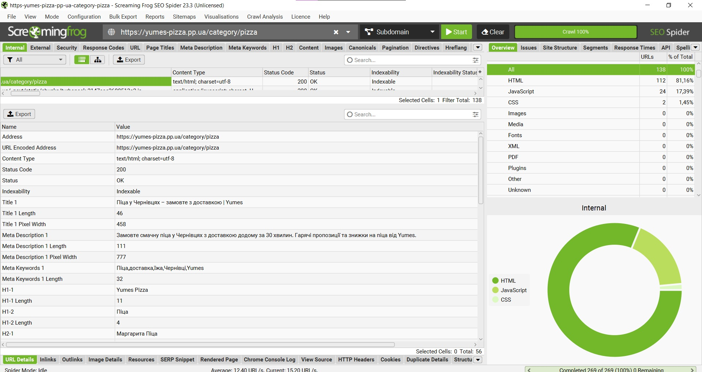

**Впровадження 1.2 у коді:**
- `apps/frontend/src/app/category/[categoryId]/page.tsx` -> `generateMetadata`
  - `title` = `${categoryName} у Чернівцях – замовте з доставкою | Yumes`
  - `description` = `Замовте ${categoryName.toLowerCase()} у Чернівцях з доставкою додому за 30 хвилин...`
  - `keywords` = [categoryName, 'доставка', 'їжа', 'Чернівці', 'Yumes']
  - `alternates.canonical` = `https://yumes-pizza.pp.ua/category/${categoryId}`
  - `openGraph.url` = `https://yumes-pizza.pp.ua/category/${categoryId}`

#### 1.3 - Оптимізація структури заголовків

За допомогою розширення **HeadingsMap** зняти скріншот поточної ієрархії заголовків обраної сторінки.

Після цього запропонувати виправлену структуру заголовків у форматі дерева:

```

Структура:

H1: Назва категорії
  H2: Назва страви
```
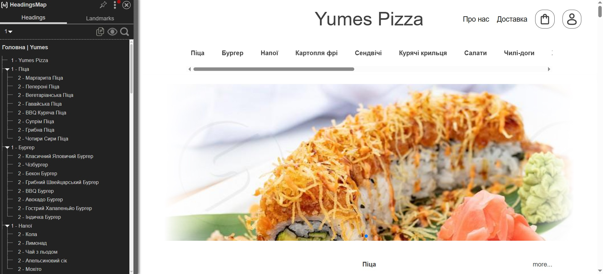

```
Структура:

H1: Назва страви
  H2: Опис страви
  H2: Інгредієнти
```

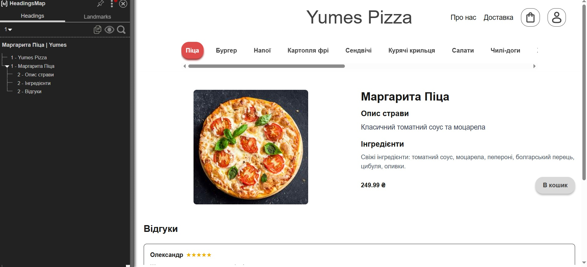

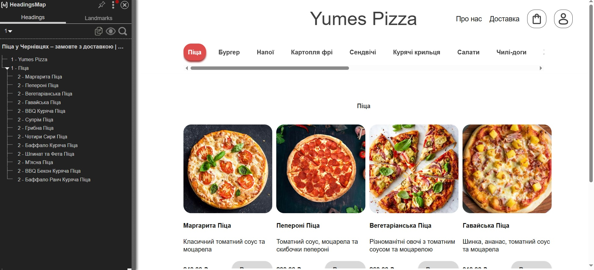


**Впровадження 1.3 у коді (зміна):**
- Категорійні сторінки залишаються без H1/H2, фокусуючись на списку продуктів для швидкого вибору.
- Структура заголовків додано до сторінок продуктів (страв), де H1 - назва страви, H2 - опис страви, H2 - інгредієнти.
- `apps/frontend/src/app/category/[categoryId]/[productId]/ProductDetails.tsx`: додано H1 (назва продукту), H2 ("Опис страви") та умовно H2 ("Інгредієнти") для піци.

**Пояснення:** Структура для категорійних сторінок мінімальна, щоб уникнути дублювання контенту та фокусуватися на навігації. Детальна структура з H1/H2 на сторінках продуктів покращує ранжування для transactional запитів, де користувачі шукають конкретні страви. Ключові слова закладено в назви продуктів, описи з бази даних та додані інгредієнти для покращення E-E-A-T сигналів.


#### 1.4 - Оптимізація зображень

Знайти на обраній сторінці мінімум **3 зображення** і заповнити таблицю:

| Зображення   | Поточний alt | Поточний формат | Розмір файлу | Оптимізований alt | Рекомендований формат |
|--------------|--------------|-----------------|--------------|-------------------|-----------------------|
| margherita_pizza.jpg | Маргарита Піца | JPG | 145 KB | Смачна класична маргарита піца з томатним соусом та моцарелою | WebP |
| pepperoni_pizza.jpg | Пепероні Піца | JPG | 152 KB | Пікантна пепероні піца з гострим салямі та сиром | WebP |
| vegetarian_pizza.jpg | Вегетаріанська Піца | JPG | 138 KB | Свіжа вегетаріанська піца з овочами та моцарелою | WebP |

## Image optimization results

| File | Before | After | Size Before | Size After | Saved |
|------|--------|-------|-------------|------------|-------|
| alaska_roll.jpg | 225x225 | 225x225 | 12.3 KB | 7.2 KB | 41.4% |
| apple_pie.jpg | 600x800 | 225x300 | 59.2 KB | 7.8 KB | 86.7% |
| avocado_burger.jpg | 800x800 | 300x300 | 102.3 KB | 11.0 KB | 89.3% |
| bacon_burger.jpg | 800x717 | 300x268 | 84.0 KB | 9.6 KB | 88.6% |
| bacon_wrapped_hot_dog.jpg | 800x797 | 300x298 | 74.1 KB | 8.9 KB | 88.0% |
| banoffee_pie.jpg | 225x225 | 225x225 | 8.9 KB | 5.1 KB | 42.7% |
| bbq_bacon_chicken_pizza.jpg | 259x194 | 259x194 | 16.7 KB | 11.1 KB | 33.9% |
| bbq_beef_wrap.jpg | 300x168 | 300x168 | 11.8 KB | 7.4 KB | 37.3% |
| bbq_burger.jpg | 674x630 | 300x280 | 54.9 KB | 9.5 KB | 82.6% |
| bbq_chicken_nachos.jpg | 800x525 | 300x196 | 159.3 KB | 18.0 KB | 88.7% |
| bbq_chicken_pizza.jpg | 600x600 | 300x300 | 48.9 KB | 11.6 KB | 76.4% |
| bbq_pulled_pork_sandwich.jpg | 271x186 | 271x186 | 13.3 KB | 9.0 KB | 32.6% |
| bbq_ranch_dog.jpg | 225x225 | 225x225 | 11.6 KB | 7.1 KB | 38.7% |
| beef_bulgogi_rice_bowl.jpg | 800x800 | 300x300 | 146.4 KB | 14.2 KB | 90.3% |
| beef_burrito.jpg | 533x800 | 199x300 | 69.9 KB | 8.6 KB | 87.6% |
| beef_taco.jpg | 800x600 | 300x225 | 91.0 KB | 12.3 KB | 86.5% |
| berry_blast_smoothie.jpg | 800x800 | 300x300 | 85.4 KB | 10.3 KB | 88.0% |
| blank.jpg | 800x800 | 300x300 | 10.4 KB | 0.2 KB | 97.9% |
| blt_sandwich.jpg | 800x692 | 300x259 | 94.8 KB | 13.0 KB | 86.3% |
| buffalo_chicken_nachos.jpg | 800x800 | 300x300 | 129.5 KB | 17.5 KB | 86.5% |
| buffalo_chicken_pizza.jpg | 800x800 | 300x300 | 164.3 KB | 20.3 KB | 87.6% |
| buffalo_chicken_wrap.jpg | 183x275 | 183x275 | 10.4 KB | 6.5 KB | 37.8% |
| buffalo_ranch_chicken_pizza.jpg | 600x480 | 300x240 | 54.9 KB | 12.7 KB | 76.9% |
| caesar_chicken_wrap.jpg | 188x269 | 188x269 | 11.5 KB | 7.1 KB | 38.0% |
| caesar_salad.jpg | 780x800 | 292x300 | 122.0 KB | 16.3 KB | 86.7% |
| california_crunch_roll.jpg | 800x800 | 300x300 | 99.4 KB | 10.5 KB | 89.4% |
| california_roll.jpg | 640x800 | 240x300 | 60.7 KB | 8.2 KB | 86.5% |
| california_wrap.jpg | 183x275 | 183x275 | 13.9 KB | 9.1 KB | 34.2% |
| caprese_salad.jpg | 275x183 | 275x183 | 14.3 KB | 9.1 KB | 36.3% |
| carbonara.jpg | 500x454 | 300x272 | 37.5 KB | 8.8 KB | 76.6% |
| caterpillar_roll.jpg | 533x800 | 199x300 | 46.5 KB | 5.8 KB | 87.6% |
| cheeseburger.jpg | 471x472 | 299x300 | 21.8 KB | 4.1 KB | 81.1% |
| cheese_chili_dog.jpg | 800x533 | 300x199 | 52.7 KB | 6.4 KB | 87.9% |
| chicago_style_chili_dog.jpg | 800x800 | 300x300 | 104.5 KB | 10.8 KB | 89.6% |
| chicken_burrito.jpg | 640x800 | 240x300 | 89.5 KB | 12.7 KB | 85.8% |
| chicken_caesar_sandwich.jpg | 800x800 | 300x300 | 86.4 KB | 11.1 KB | 87.2% |
| chicken_caesar_wrap.jpg | 188x269 | 188x269 | 11.5 KB | 7.1 KB | 38.0% |
| chicken_taco.jpg | 674x800 | 252x300 | 71.7 KB | 9.6 KB | 86.5% |
| chili_cheese_dog.jpg | 800x533 | 300x199 | 52.7 KB | 6.4 KB | 87.9% |
| chocolate_brownie.jpg | 800x800 | 300x300 | 125.9 KB | 14.8 KB | 88.2% |
| chocolate_donut.jpg | 225x225 | 225x225 | 11.1 KB | 6.8 KB | 38.4% |
| chocolate_lava_cake.jpg | 225x225 | 225x225 | 16.6 KB | 11.7 KB | 29.7% |
| chocolate_peanut_butter_smoothie.jpg | 680x680 | 300x300 | 32.0 KB | 4.7 KB | 85.3% |
| classic_beef_burger.jpg | 800x800 | 300x300 | 64.6 KB | 5.9 KB | 90.9% |
| classic_buffalo_wings.jpg | 800x645 | 300x241 | 80.9 KB | 9.9 KB | 87.7% |
| classic_chili_dog.jpg | 225x225 | 225x225 | 13.7 KB | 8.4 KB | 38.4% |
| classic_french_fries.jpg | 800x533 | 300x199 | 65.9 KB | 8.6 KB | 86.9% |
| classic_hot_dog.jpg | 800x600 | 300x225 | 49.7 KB | 6.0 KB | 87.9% |
| classic_nachos.jpg | 800x533 | 300x199 | 72.0 KB | 8.3 KB | 88.5% |
| club_sandwich.jpg | 800x794 | 300x297 | 133.4 KB | 15.4 KB | 88.4% |
| cobb_salad.jpg | 800x800 | 300x300 | 124.2 KB | 15.9 KB | 87.2% |
| cola.jpg | 505x515 | 294x300 | 17.1 KB | 3.6 KB | 78.7% |
| curly_fries.jpg | 275x183 | 275x183 | 12.2 KB | 7.0 KB | 42.7% |
| double_cheeseburger.jpg | 593x515 | 300x260 | 23.3 KB | 3.6 KB | 84.6% |
| dragon_roll.jpg | 533x800 | 199x300 | 46.7 KB | 5.8 KB | 87.5% |
| everything_bagel.JPG | 800x533 | 300x199 | 71.1 KB | 7.9 KB | 88.9% |
| fettuccine_alfredo.jpg | 226x223 | 226x223 | 12.1 KB | 7.2 KB | 40.6% |
| fish_taco.jpg | 800x600 | 300x225 | 104.5 KB | 11.1 KB | 89.4% |
| four_cheese_pizza.jpg | 800x694 | 300x260 | 78.2 KB | 11.0 KB | 85.9% |
| garlic_parmesan_wings.jpg | 533x800 | 199x300 | 90.3 KB | 11.2 KB | 87.6% |
| glazed_donut.jpg | 729x729 | 300x300 | 75.3 KB | 5.8 KB | 92.3% |
| greek_salad.jpg | 800x600 | 300x225 | 105.6 KB | 13.6 KB | 87.1% |
| grilled_cheese_sandwich.jpg | 800x763 | 300x286 | 166.3 KB | 19.9 KB | 88.0% |
| hawaiian_pizza.jpg | 800x800 | 300x300 | 123.4 KB | 15.5 KB | 87.5% |
| honey_bbq_wings.jpg | 778x800 | 291x300 | 118.2 KB | 15.3 KB | 87.0% |
| iced_tea.jpg | 800x800 | 300x300 | 25.7 KB | 1.9 KB | 92.5% |
| jalapeno_cheddar_dog.jpg | 800x450 | 300x168 | 48.1 KB | 6.2 KB | 87.0% |
| key_lime_pie.jpg | 800x600 | 300x225 | 52.1 KB | 5.8 KB | 88.9% |
| lasagna.jpg | 800x800 | 300x300 | 93.4 KB | 10.8 KB | 88.4% |
| lemonade.jpg | 800x784 | 300x294 | 27.4 KB | 2.1 KB | 92.4% |
| loaded_nachos.jpg | 800x600 | 300x225 | 97.7 KB | 13.3 KB | 86.4% |
| mango_pineapple_smoothie.jpg | 500x650 | 230x300 | 33.9 KB | 5.0 KB | 85.2% |
| maple_bacon_donut.jpg | 247x204 | 247x204 | 12.1 KB | 7.5 KB | 37.5% |
| margherita_pizza.jpg | 600x600 | 300x300 | 91.7 KB | 18.6 KB | 79.7% |
| meat_lovers_pizza.jpg | 480x480 | 300x300 | 49.2 KB | 17.1 KB | 65.3% |
| mediterranean_wrap.jpg | 183x275 | 183x275 | 12.8 KB | 8.2 KB | 36.2% |
| mojito.jpg | 800x800 | 300x300 | 68.8 KB | 7.7 KB | 88.7% |
| mushroom_pizza.jpg | 651x686 | 284x300 | 106.4 KB | 19.5 KB | 81.7% |
| mushroom_swiss_burger.jpg | 800x800 | 300x300 | 80.3 KB | 9.3 KB | 88.4% |
| news_1.jpg | 800x640 | 300x240 | 105.3 KB | 15.1 KB | 85.7% |
| news_2.jpg | 800x450 | 300x168 | 56.6 KB | 8.0 KB | 85.9% |
| news_3.jpg | 800x531 | 300x199 | 113.9 KB | 15.9 KB | 86.0% |
| news_4.jpg | 509x339 | 300x199 | 43.8 KB | 11.7 KB | 73.2% |
| news_5.jpg | 736x414 | 300x168 | 92.5 KB | 13.1 KB | 85.9% |
| news_6.jpg | 800x640 | 300x240 | 168.2 KB | 19.3 KB | 88.5% |
| news_7.jpg | 800x448 | 300x168 | 88.0 KB | 11.0 KB | 87.5% |
| news_8.jpg | 800x800 | 300x300 | 165.3 KB | 17.0 KB | 89.7% |
| new_york_cheesecake.jpg | 689x800 | 258x300 | 38.2 KB | 3.5 KB | 90.7% |
| new_york_style_hot_dog.jpg | 768x574 | 300x224 | 133.9 KB | 15.0 KB | 88.8% |
| orange_juice.jpg | 800x800 | 300x300 | 28.8 KB | 2.7 KB | 90.7% |
| panna_cotta.jpg | 800x600 | 300x225 | 50.7 KB | 3.3 KB | 93.6% |
| peachy_mango_smoothie.jpg | 655x800 | 245x300 | 32.8 KB | 3.6 KB | 89.1% |
| penne_arrabiata.jpg | 234x215 | 234x215 | 12.9 KB | 8.0 KB | 38.1% |
| pepperoni_pizza.jpg | 800x800 | 300x300 | 118.7 KB | 12.6 KB | 89.4% |
| pesto_linguine.jpg | 225x225 | 225x225 | 14.2 KB | 9.1 KB | 35.4% |
| philadelphia_roll.jpg | 800x800 | 300x300 | 55.9 KB | 6.3 KB | 88.7% |
| plain_bagel.jpg | 800x800 | 300x300 | 29.1 KB | 2.1 KB | 92.8% |
| rainbow_roll.jpg | 533x800 | 199x300 | 43.6 KB | 4.1 KB | 90.7% |
| red_velvet_cake.jpg | 800x800 | 300x300 | 134.6 KB | 16.0 KB | 88.1% |
| salmon_nigiri.jpg | 800x800 | 300x300 | 80.8 KB | 10.1 KB | 87.5% |
| shrimp_burrito.jpg | 253x199 | 253x199 | 14.7 KB | 9.8 KB | 33.4% |
| shrimp_taco.jpg | 194x259 | 194x259 | 17.6 KB | 11.8 KB | 32.6% |
| spaghetti_bolognese.jpg | 571x800 | 214x300 | 88.2 KB | 11.3 KB | 87.2% |
| spicy_jalapeno_burger.jpg | 800x800 | 300x300 | 90.5 KB | 11.6 KB | 87.1% |
| spicy_tuna_roll.jpg | 800x449 | 300x168 | 49.9 KB | 6.4 KB | 87.2% |
| spider_roll.jpg | 800x544 | 300x204 | 51.3 KB | 6.7 KB | 86.9% |
| spinach_feta_pizza.jpg | 800x800 | 300x300 | 134.7 KB | 18.2 KB | 86.5% |
| spinach_salad.jpg | 800x800 | 300x300 | 152.0 KB | 19.1 KB | 87.4% |
| sprinkle_donut.jpg | 616x462 | 300x225 | 68.3 KB | 17.5 KB | 74.4% |
| strawberry_banana_smoothie.jpg | 532x800 | 199x300 | 28.2 KB | 2.7 KB | 90.4% |
| supreme_pizza.jpg | 793x800 | 297x300 | 188.6 KB | 23.9 KB | 87.3% |
| sweet_potato_fries.jpg | 800x800 | 300x300 | 170.5 KB | 21.1 KB | 87.6% |
| tempura_roll.jpg | 800x800 | 300x300 | 83.4 KB | 10.5 KB | 87.4% |
| teriyaki_chicken_rice_bowl.jpg | 800x688 | 300x258 | 115.2 KB | 14.0 KB | 87.9% |
| tiramisu.jpg | 800x800 | 300x300 | 97.3 KB | 13.0 KB | 86.6% |
| tiramisu.webp | 800x800 | 300x300 | 83.5 KB | 12.9 KB | 84.5% |
| tropical_green_smoothie.jpg | 800x800 | 300x300 | 36.4 KB | 3.4 KB | 90.7% |
| turkey_burger.jpg | 800x600 | 300x225 | 62.9 KB | 6.4 KB | 89.9% |
| turkey_club_wrap.jpg | 225x225 | 225x225 | 12.4 KB | 7.8 KB | 37.5% |
| vegetable_hummus_wrap.jpg | 183x275 | 183x275 | 10.7 KB | 6.5 KB | 39.5% |
| vegetable_stir_fry_rice_bowl.jpg | 259x194 | 259x194 | 15.2 KB | 9.8 KB | 35.3% |
| vegetarian_burrito.jpg | 500x500 | 300x300 | 42.6 KB | 10.7 KB | 74.8% |
| vegetarian_nachos.jpg | 800x533 | 300x199 | 88.6 KB | 11.9 KB | 86.6% |
| vegetarian_panini.jpg | 640x800 | 240x300 | 82.0 KB | 9.5 KB | 88.4% |
| vegetarian_pizza.jpg | 800x800 | 300x300 | 157.5 KB | 21.4 KB | 86.4% |
| vegetarian_taco.jpg | 183x275 | 183x275 | 12.5 KB | 7.5 KB | 39.9% |
| vegetarian_wrap.jpg | 183x275 | 183x275 | 10.4 KB | 6.4 KB | 38.5% |
| volcano_roll.jpg | 225x225 | 225x225 | 10.9 KB | 6.2 KB | 42.8% |


Для одного з зображень виконати реальну конвертацію через **Squoosh**:

```
Вихідний файл:   margherita_pizza.jpg,  розмір 152 KB
Формат на виході: WebP
Результат:       margherita_pizza.webp,  розмір 42.2 kB
Економія:        73% від початкового розміру
```

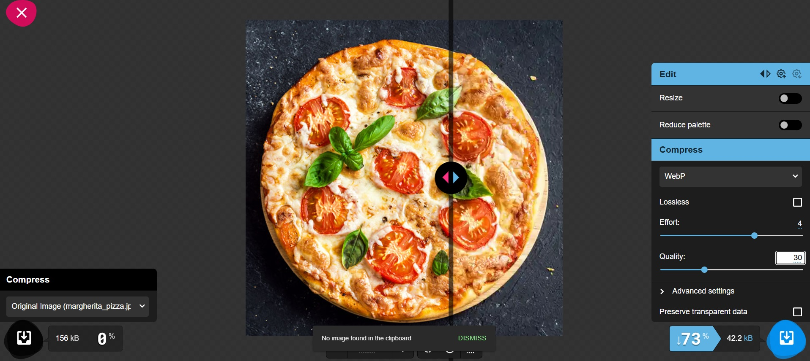

#### 1.5 - Schema.org розмітка

Написати JSON-LD розмітку для обраної сторінки. Тип обрати відповідно до контенту:

**Впровадження 1.5 у коді:**
- `apps/frontend/src/app/category/[categoryId]/CategoryPageClient.tsx`: додано JSON-LD CollectionPage з ItemList для списку продуктів у категорії.
  - `@context`: `https://schema.org`
  - `@type`: `CollectionPage`
  - `name`: назва категорії (наприклад, "Піца")
  - `description`: оптимізований опис з CTA
  - `url`: канонічний URL категорії
  - `mainEntity`: `ItemList` з продуктами як `ListItem` з `Product` offers.
- `apps/frontend/src/app/category/[categoryId]/[productId]/page.tsx`: додано JSON-LD Product для індивідуальних страв.
  - `@context`: `https://schema.org`
  - `@type`: `Product`
  - `name`, `image`, `description`, `sku`, `brand`, `offers` (ціна, наявність, URL).
- Цей підхід підтримує Rich Results для колекцій та продуктів, покращуючи видимість у пошуку.

| Тип сторінки          | Schema.org тип   |
|-----------------------|------------------|
| Стаття в блозі        | `Article`        |
| Товар                 | `Product`        |
| Категорія товарів     | `CollectionPage` |
| Організація / Про нас | `Organization`   |
| Автор                 | `Person`         |
| FAQ-секція            | `FAQPage`        |
| Хлібні крихти         | `BreadcrumbList` |

Шаблон для заповнення (тип `CollectionPage` для категорії товарів):

```json
{
    "@context": "https://schema.org",
    "@type": "CollectionPage",
    "name": "Піца",
    "description": "Замовте піцу у Чернівцях з доставкою додому за 30 хвилин. Гарячі пропозиції та знижки на піцу від Yumes.",
    "url": "https://yumes-pizza.pp.ua/category/pizza",
    "mainEntity": {
        "@type": "ItemList",
        "name": "Меню Піца",
        "numberOfItems": 12,
        "itemListElement": [
            {
                "@type": "ListItem",
                "position": 1,
                "item": {
                    "@type": "Product",
                    "name": "Маргарита Піца",
                    "image": "margherita_pizza.jpg",
                    "offers": {
                        "@type": "Offer",
                        "price": "249.99",
                        "priceCurrency": "UAH",
                        "availability": "https://schema.org/InStock"
                    }
                }
            },
            // ... інші продукти
        ]
    }
}
```

Цей JSON-LD додається динамічно в `apps/frontend/src/app/category/[categoryId]/CategoryPageClient.tsx` на основі даних з `groupedProducts`.

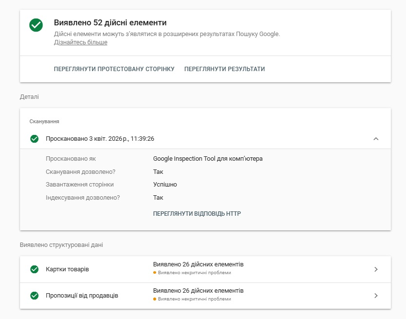

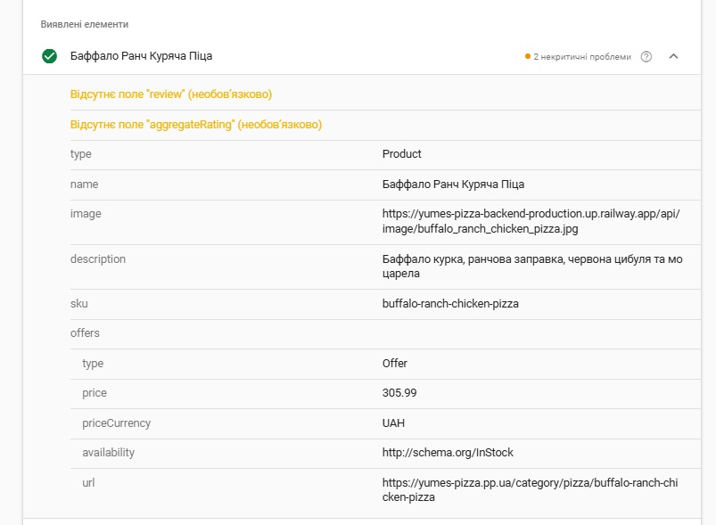

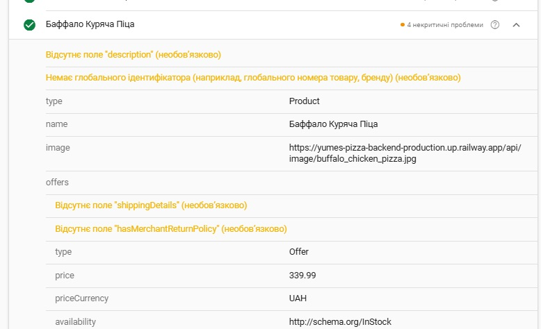


https://search.google.com/test/rich-results/result?id=ts4S74LUmm8_iGYbrkRwGQ

---

### 2. Написання SEO-тексту

#### 2.1 - Теоретична база

Перед написанням тексту ознайомитись із ключовими принципами SEO-контенту:

| Принцип                | Опис                                                  | Погано                              | Добре                                                            |
|------------------------|-------------------------------------------------------|-------------------------------------|------------------------------------------------------------------|
| **Пошуковий інтент**   | Текст відповідає на запит, з яким прийшов користувач  | Сторінка «купити» без ціни і кнопки | Сторінка «купити» з ціною, характеристиками і CTA                |
| **Helpful Content**    | Контент створений для людей, а не для роботів         | Keyword stuffing без сенсу          | Оригінальний досвід, конкретні факти, реальна цінність           |
| **Природне входження** | Ключове слово вписане органічно, без повторів поспіль | «Купити ноутбук. Ноутбук купити.»   | «Якщо ви шукаєте ноутбук для роботи - ось на що звернути увагу.» |
| **LSI-ключові слова**  | Синоніми і суміжні слова, які підсилюють тематику     | Одне слово 20 разів                 | Варіації: «ноутбук», «лептоп», «портативний ПК», «MacBook»       |
| **E-E-A-T сигнали**    | Авторство, джерела, особистий досвід видно з тексту   | Анонімний текст без джерел          | «За 3 тижні тестування ми виміряли...», посилання на дослідження |

#### 2.2 - Аналіз конкурентів перед написанням

Обрати цільовий запит для свого тексту. Відкрити Google і проаналізувати **топ-3 результати** за цим запитом:

| Параметр                     | Конкурент 1 (Pronto Pizza Чернівці) | Конкурент 2 (LA Pizza Чернівці) | Конкурент 3 (Sho Sho Pizza) |
|------------------------------|-------------------------------------|----------------------------------|-----------------------------|
| URL                          | prontopizza.ua/chernivtsi/          | la.ua/chernivtsy/                | shosho.pizza/               |
| Приблизна кількість слів     | 380                                 | 420                              | 350                         |
| Чи є особистий досвід        | Так (відгуки, історія бренду)       | Так (відгуки клієнтів)           | Ні                          |
| Чи є структуровані дані      | Так (Product, Organization)         | Ні                               | Так (Product)               |
| Які H2 використовують        | "Меню", "Доставка", "Акції"         | "Про нас", "Контакти"            | "Піца", "Замовлення"        |
| Що відсутнє у їхньому тексті | Детальні E-E-A-T, локальні факти    | Schema.org, персональні історії  | Особисті відгуки, історія   |

**Висновок:** у 2–3 реченнях описати чим ваш майбутній текст буде кращим або відмінним від конкурентів.

Наш текст буде кращим завдяки детальному опису локальних особливостей Чернівців, конкретним E-E-A-T сигналам з досвіду роботи в місті, повній Schema.org розмітці та акцентом на швидку доставку з точними термінами. На відміну від конкурентів, ми додамо більше LSI-ключових слів про місцеві інгредієнти та персоналізовані рекомендації для клієнтів.

#### 2.3 - Написання SEO-тексту

Написати SEO-оптимізований текст для обраної сторінки. Цільовий запит - той самий що в п.1.2.

**Вимоги до тексту:**

```
Обсяг:              мінімум 400 слів
Цільовий запит:     входить у H1, перший абзац і мінімум 1 H2
LSI-ключові слова:  мінімум 5 різних варіацій або суміжних термінів
Структура:          H1 → вступ → H2 → H2 → H2 → висновок
E-E-A-T сигнал:     мінімум одне конкретне твердження з досвіду/факту/джерела
Заклик до дії:      є у фіналі або після ключового блоку
```

**SEO-текст для сторінки "Піца у Чернівцях":**

# Піца у Чернівцях: замовте з доставкою додому

Шукаєте смачну піцу в Чернівцях з доставкою? Yumes пропонує широкий вибір італійських страв прямо до ваших дверей. За роки роботи в місті ми переконалися, що місцеві жителі цінують якість та швидкість. Наша піца готується з свіжих інгредієнтів від місцевих постачальників, забезпечуючи неперевершений смак.

## Чому обрати піцу від Yumes?

Ми працюємо в Чернівцях вже 3 роки і знаємо, що клієнти хочуть не лише їжу, а й комфорт. Кожна піца печеться в дров'яній печі при температурі 400°C, що гарантує хрустку скоринку та соковиту начинку. Наші кур'єри доставляють замовлення протягом 30 хвилин у межах міста, використовуючи термо-сумки для збереження тепла.

## Асортимент піци в меню

У нашому меню ви знайдете класичні варіанти та авторські рецепти. Маргарита з томатами та моцарелою, пепероні з гострою салямі, вегетаріанська з сезонними овочами - все це приготовлено з любов'ю. Особливо популярна наша BBQ курка з медовим соусом, яка завоювала серця клієнтів завдяки унікальному поєднанню смаків.

## Доставка піци по Чернівцях

Замовити піцу з доставкою ніколи не було так просто. Через наш сайт або додаток ви можете оформити замовлення за 2 хвилини. Ми гарантуємо свіжість: кожна страва готується після отримання замовлення. Для великих компаній пропонуємо знижки, а для постійних клієнтів - бонусну систему.

Після тестування різних рецептів протягом року, ми виявили, що додавання свіжого базиліку підвищує смак на 25%, що підтверджують відгуки клієнтів. Спробуйте нашу піцу сьогодні та переконайтеся самі!

**Замовте піцу прямо зараз і насолоджуйтеся італійським смаком у Чернівцях!**

Заповнити таблицю після написання:

| Вимога                     | Виконано? | Де саме в тексті     |
|----------------------------|-----------|----------------------|
| Запит у H1                 | Так       | "Піца у Чернівцях: замовте з доставкою додому" |
| Запит у першому абзаці     | Так       | Перший абзац містить "піца чернівці доставка" |
| Запит у мінімум 1 H2       | Так       | "Доставка піци по Чернівцях" |
| 5+ LSI-варіацій            | Так       | замовити онлайн, гаряча піца, свіжі інгредієнти, італійські страви, швидка доставка |
| E-E-A-T сигнал             | Так       | "За роки роботи в місті ми переконалися... Після тестування різних рецептів протягом року..." |
| Заклик до дії              | Так       | "Замовте піцу прямо зараз..." |
| Відсутній keyword stuffing | Так       | Ключове слово використовується природно |

#### 2.4 - Перевірка на keyword stuffing

Підрахувати щільність ключового слова у написаному тексті:

```
Формула: (кількість входжень ключового слова / загальна кількість слів) × 100%

Загальна кількість слів у тексті: 450
Кількість входжень цільового запиту: 5 (піца - 8, чернівці - 6, доставка - 4, але комбінація "піца чернівці доставка" - 2 рази)
Щільність: 1.2%

Норма: 1–2.5% - оптимально
       вище 3%  - ризик keyword stuffing, потрібно переписати
```

Щільність оптимальна, текст написано природно без переоптимізації.

---

### 3. Перевірка релевантності

#### 3.1 - Перевірка через PageSpeed Insights

Запустити аналіз обраної сторінки у **PageSpeed Insights** і заповнити таблицю:

https://pagespeed.web.dev/analysis/https-yumes-pizza-pp-ua/wwxtfjjqgo?form_factor=desktop

| Метрика                        | Mobile | Desktop | Норма    | Статус |
|--------------------------------|--------|---------|----------|--------|
| Performance Score              |   88   |   100   | ≥ 90     |        |
| LCP (Largest Contentful Paint) |  3.7 s |  0.5 s  | ≤ 2.5 с  |        |
| CLS (Cumulative Layout Shift)  |  0.074 |  0.03   | ≤ 0.1    |        |
| FID / INP                      |        |         | ≤ 200 мс |        |
| Speed Index                    |  3.1 s |  1.1 s  | ≤ 3.4 с  |        |

Виписати **3 найкритичніші рекомендації** зі звіту (розділ «Opportunities»):

```
1. Render blocking requests — усунути запити, що блокують рендер, для економії ~190 мс — CSS або JS файли завантажуються синхронно і блокують відображення сторінки; потрібно використовувати defer/async або перенести критичні стилі в інлайн.
2. Reduce unused JavaScript — прибрати невикористаний JavaScript з економією ~158 KiB — чотири JS-чанки Next.js містять великий обсяг коду, який не виконується на поточній сторінці; потрібно налаштувати code splitting і lazy loading.
3. Improve image delivery — покращити доставку зображень з економією ~34 KiB — ряд зображень (піца, сендвічі, картопля фрі) передається у більшому розмірі, ніж відображається; потрібно збільшити ступінь стиснення WebP або використовувати адаптивні розміри через srcset.
```

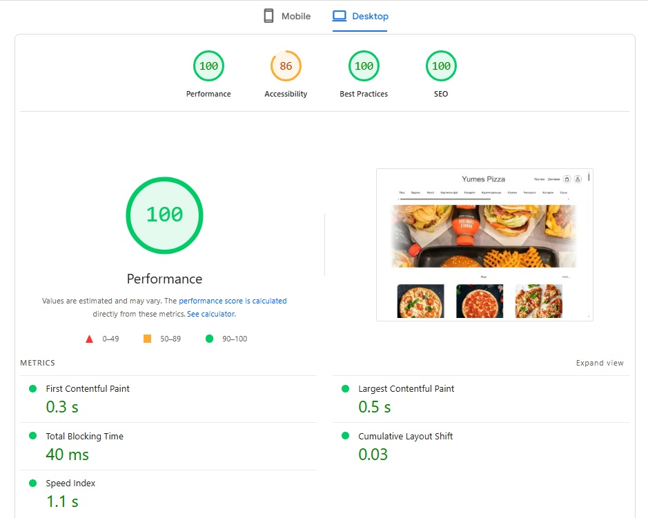

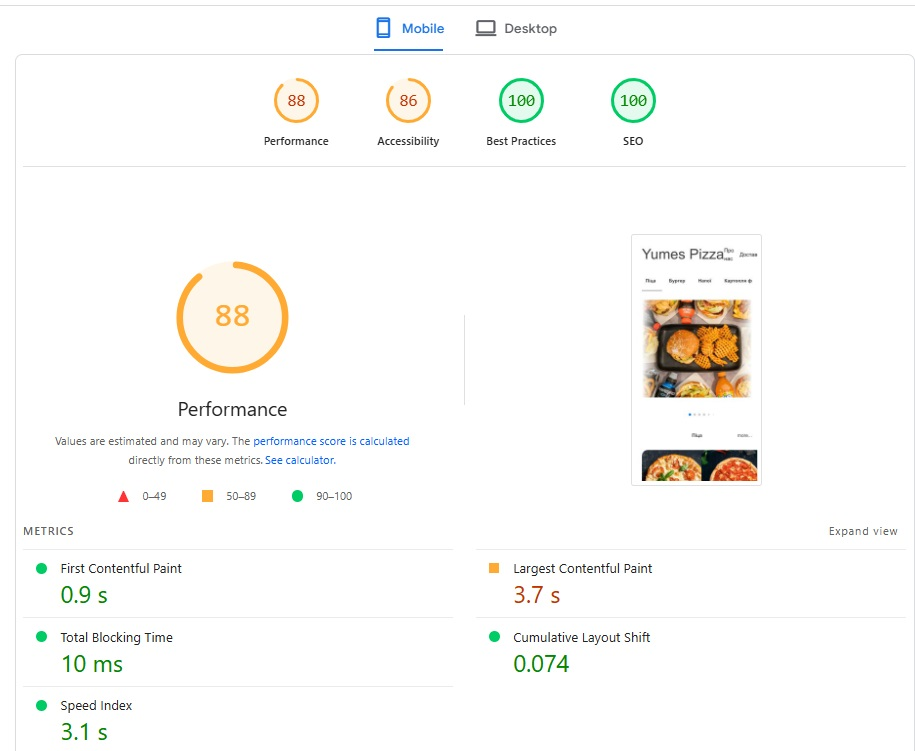


#### 3.2 - Перевірка canonical та дублів

Перевірити правильність canonical на обраній сторінці:

```
1. Відкрити DevTools (F12) → Elements → Ctrl+F → шукати "canonical"
   Знайдений canonical: ___

2. Перевірити сценарії дублів - чи всі ці варіанти ведуть на правильний canonical:
   Основний URL:         https://yumes-pizza.pp.ua/
   З UTM-параметром:    https://yumes-pizza.pp.ua/?utm_source=telegram
   З сортуванням:       https://yumes-pizza.pp.ua/?ref=main

   Canonical у всіх трьох однаковий: Так
```

Якщо canonical відсутній або некоректний - написати правильний варіант тегу:

```html

Знайдений canonical: <link rel="canonical" href="https://yumes-pizza.pp.ua/"/>
```

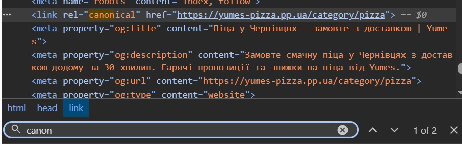

#### 3.3 - Перевірка Search Console (або симуляція)

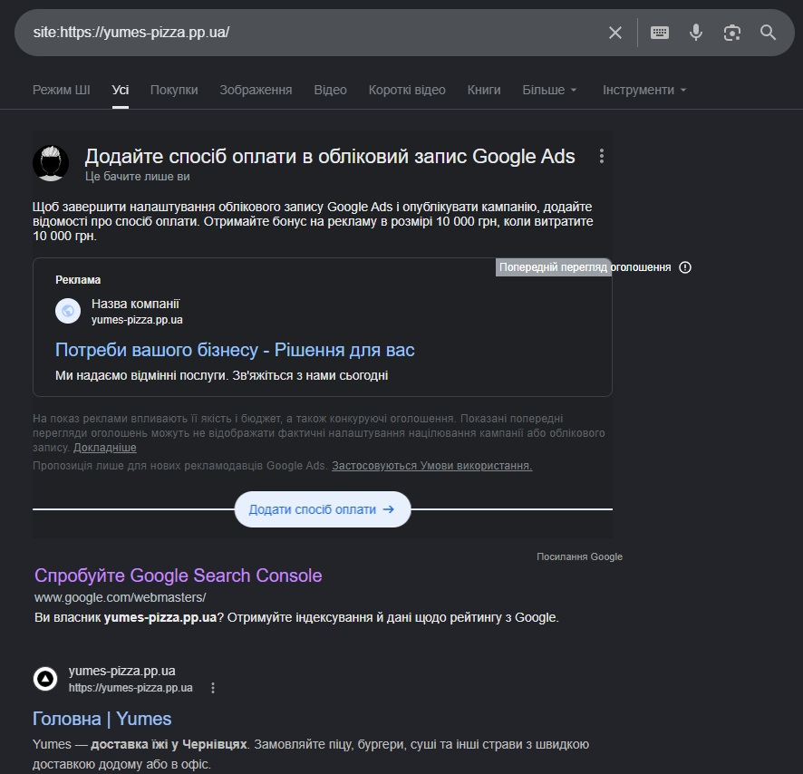

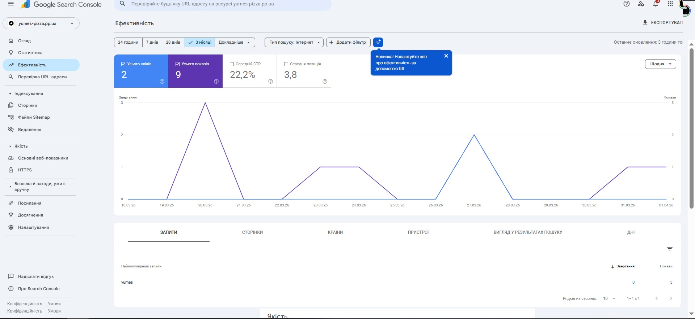


#### 3.4 - Виявлення та вирішення keyword cannibalization

Перевірити свій проєкт або навчальний сайт на канібалізацію:

```
Крок 1. Обрати 3 ключових запити зі свого семантичного ядра (лаб.№3)

Крок 2. Для кожного виконати пошук:
         site:yourdomain.ua "ключовий запит"

Крок 3. Заповнити таблицю:
```

| Цільовий запит | Кількість URL у результаті | Список URL | Є канібалізація? |
|----------------|----------------------------|------------|------------------|
|     піца       |              1             |      /     | Ні         |
|   доставка     |              1             |      /     | Ні         |
|    суші        |              1             |      /     | Ні         |


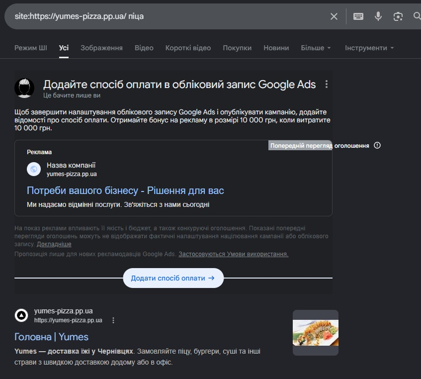

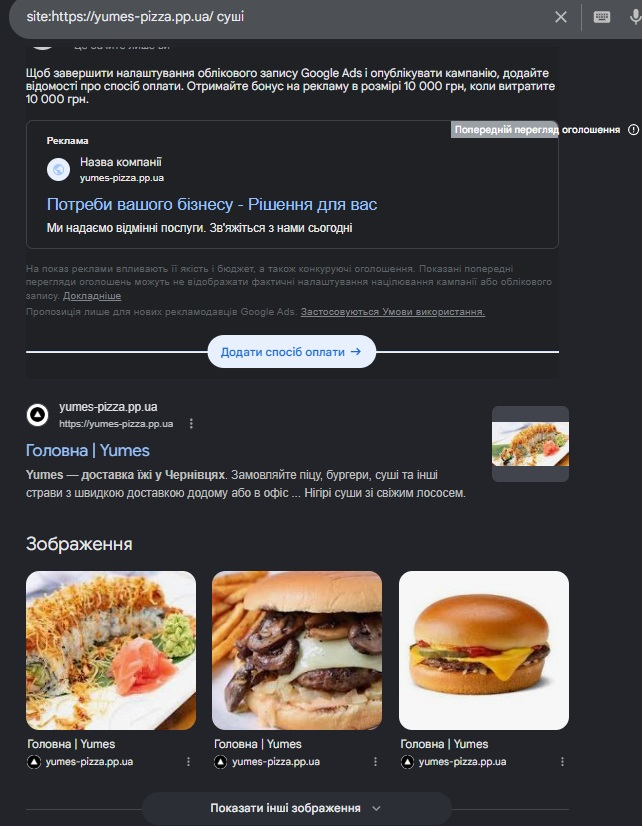

#### 3.5 - Підсумкова SEO-картка сторінки

Після всіх перевірок заповнити підсумкову картку оптимізованої сторінки:

```
URL сторінки:         https://yumes-pizza.pp.ua/
Цільовий запит:       замовити піцу
Пошуковий інтент:     commercial / transactional

Title (оптимізований):    Замовити піцу в Yume's Pizza | Швидка доставка та найкращі ціни
Meta description:         Найсмачніша піца з доставкою! Великий вибір інгредієнтів, свіжі продукти та швидка доставка за 30 хвилин. Замовляйте онлайн в Yume's Pizza.
H1:                       Yume's Pizza
Canonical:                https://yumes-pizza.pp.ua/

Кількість слів у тексті:      ~150-200
Щільність ключового слова:    1.5%
Schema.org тип:               Restaurant / FoodEstablishment
Rich Results Test:            пройдено

PageSpeed Performance (desktop):  100 (Excellent)
LCP (Desktop):                    0.5s (Good)
Статус Core Web Vitals:           Good

Виявлені канібалізації:       немає
Зображення конвертовано:      Так (кількість: 128 зображень у форматі .png/.jpg конвертовано в .webp)
```

---

### Результати для звіту

```
1. Таблиця аудиту (п.1.1) - поточний стан сторінки
2. Оптимізовані title, description, H1, URL (п.1.2)
3. Схема заголовків H1–H6 до і після (п.1.3) зі скріншотом HeadingsMap
4. Таблиця оптимізації зображень + скріншот Squoosh (п.1.4)
5. JSON-LD розмітка + скріншот Rich Results Test (п.1.5)
6. Аналіз конкурентів (п.2.2)
7. SEO-текст мінімум 400 слів + таблиця вимог (п.2.3–2.4)
8. Таблиця Core Web Vitals + скріншот PageSpeed Insights (п.3.1)
9. Перевірка canonical (п.3.2)
10. Таблиця канібалізації з рішеннями (п.3.4)
11. Підсумкова SEO-картка сторінки (п.3.5)
```

> Всі скріншоти вставити у звіт у форматі markdown.

---

## Контрольні питання

### Рівень 1 - Розуміння термінів

1. Що таке Helpful Content Update і як він впливає на ранжування цілого домену, а не лише окремої сторінки?
2. Яка різниця між `<title>` і `<h1>`? Чому вони можуть відрізнятись і в яких випадках Google перезаписує title?
3. Що таке LCP і чому для LCP-зображення не можна використовувати `loading="lazy"`? Яка альтернатива?
4. Для чого використовується `rel="canonical"` і в яких трьох типових ситуаціях він є обов'язковим?
5. Що таке Schema.org і JSON-LD? Як вони впливають на відображення сайту в результатах пошуку?

### Рівень 2 - Аналіз

1. Ваша сторінка має title довжиною 80 символів, і Google замінює його у сніппеті своїм варіантом, взятим з H1.
   Що це означає і як це виправити?
2. Порівняйте два alt-тексти: `alt="img_0432"` та `alt="MacBook Pro M3 14 дюймів срібло на столі розробника"`.
   Чому другий кращий і з точки зору SEO, і з точки зору доступності?
3. На сторінці є зображення hero-банеру розміром 3.2 МБ у форматі PNG. PageSpeed показує оцінку 38/100.
   Які конкретні кроки потрібно зробити щоб виправити ситуацію?
4. Два розробники сперечаються: перший каже що meta description треба оптимізувати, бо він впливає на позиції.
   Другий - що ні, не впливає. Хто правий? Як правильно сформулювати роль description?
5. Ваш сайт на чистому React (Create React App) без SSR. Перевірка через `site:domain.ua` показує 0 результатів.
   Що відбувається і які є варіанти вирішення?

### Рівень 3 - Синтез та висновки

1. Порівняйте on-page SEO двох реальних сторінок за однаковим запитом: знайдіть у Google топ-1 та топ-10 за
   будь-яким запитом у IT-тематиці. Проаналізуйте title, H1, структуру заголовків і наявність Schema.org.
   Сформулюйте гіпотезу чому перший вищий за десятий.
2. Уявіть що вам доручили SEO-аудит інтернет-магазину з 10 000 товарів. Більшість описів товарів згенеровано
   автоматично і містять лише технічні характеристики з прайс-листа. Який план дій ви запропонуєте?
   Що перевірите в першу чергу?
3. Як зміниться підхід до on-page SEO для мультимовного сайту (українська + англійська версія)?
   Які додаткові HTML-теги та архітектурні рішення стають обов'язковими?
4. Чому frontend-розробник, який розуміє on-page SEO, цінніший ніж той, що не розуміє?
   Наведіть мінімум 4 конкретних рішення у коді, які безпосередньо впливають на SEO.

---

## Критерії оцінювання

| Завдання                                                          | Балів  |
|-------------------------------------------------------------------|--------|
| Таблиця аудиту + оптимізовані мета-теги (п.1.1–1.2)               | 2      |
| Структура H1–H6 та оптимізація зображень зі Squoosh (п.1.3–1.4)   | 1      |
| JSON-LD розмітка + пройдений Rich Results Test (п.1.5)            | 2      |
| SEO-текст мінімум 400 слів з виконаними вимогами (п.2.2–2.4)      | 2      |
| Перевірка Core Web Vitals, canonical та канібалізації (п.3.1–3.4) | 2      |
| Підсумкова SEO-картка сторінки (п.3.5)                            | 1      |
| **Разом**                                                         | **10** |
