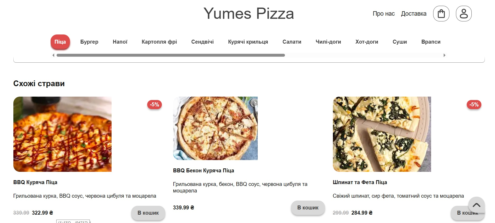
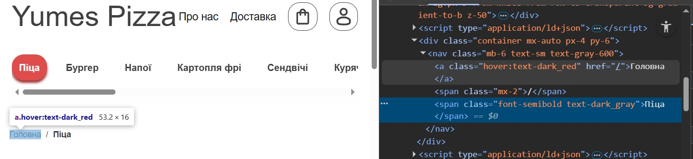
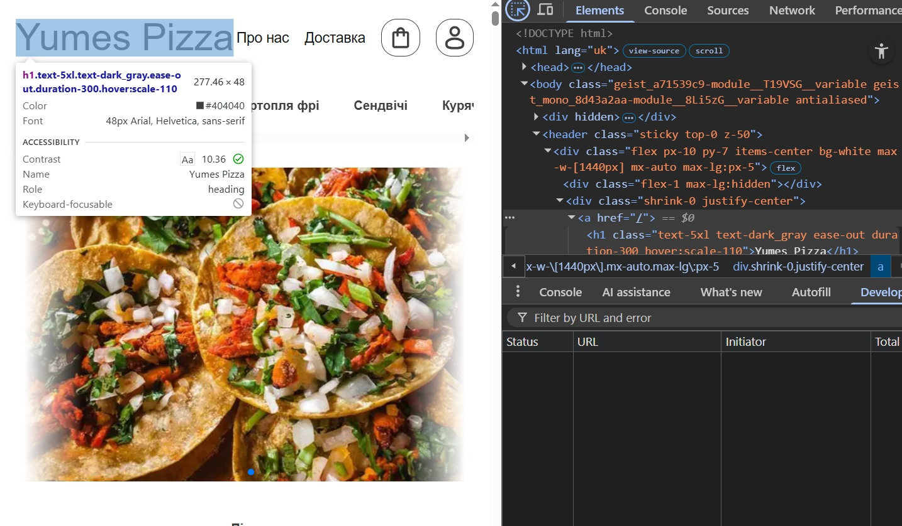
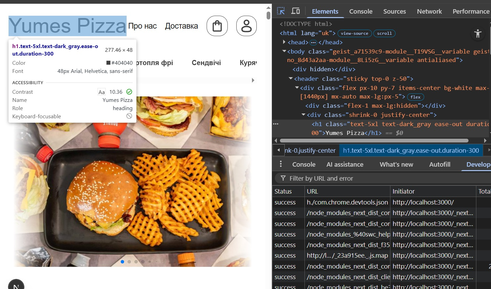
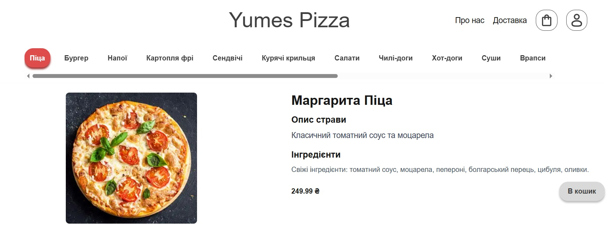

# Звіт: Лабораторна робота №5. Внутрішня перелінковка

---

## Мета

Навчитись аудитувати внутрішню перелінковку сайту, виявляти типові помилки (orphan pages, надлишкові посилання,
неправильні анкори), будувати схему перелінковки відповідно до silo-структури та впроваджувати виправлення безпосередньо
у проект.

---

## Команда:
- Атвіновський Олексій: DevOps, TeamLead
- Довгаль Кирило: Frontend Dev
- Оршовський Сергій: Backend Dev

---

## Таблиця:
https://docs.google.com/spreadsheets/d/15bsU9EAgixWIc0qaQEIXiHI2kULNqu8YYfdaQsSIxXA/edit?usp=sharing

---

## 1. Аудит поточної перелінковки

### 1.1 - Інвентаризація сторінок
*Аналіз структури посилань основних сторінок проекту (на основі локального аудиту).*

| URL | Тип сторінки | Назва | Вхідні посилання | Вихідні посилання | Статус |
| :--- | :--- | :--- | :--- | :--- | :--- |
| `/` | Головна | Головна сторінка | 1 (Header logo) | 25+ | `linked` |
| `/category/pizza` | Категорія | Піца | 4 | 12 | `linked` |
| `/category/sushi` | Категорія | Суші | 4 | 10 | `linked` |
| `/category/burgers`| Категорія | Бургери | 4 | 8 | `linked` |
| `/category/pizza/pepperoni`| Товар | Піца Пепероні | 2 | 5 | `linked` |
| `/about` | Статична | Про нас | 1 (Header) | 2 | `nav-only` |
| `/delievery` | Статична | Про доставку | 1 (Header) | 2 | `nav-only` |

### 1.2 - Виявлення orphan pages
Orphan pages відсутні

```
curl https://yumes-pizza.pp.ua/ | grep /category/pizza/pepperoni-pizza
```

```
curl https://yumes-pizza.pp.ua/ | grep /category/pizza/pepperoni-pizza
```

### 1.3 - Аналіз анкорів
*Аналіз 5 вихідних посилань з головної сторінки до категорій та товарів.*

| Сторінка-джерело | Анкор текст | URL призначення | Тип анкору | Оцінка |
| :--- | :--- | :--- | :--- | :--- |
| `/` | "Піца" | `/category/pizza` | `nav` | ✅ |
| `/` | "Суші" | `/category/sushi` | `nav` | ✅ |
| `/` | "Бургери" | `/category/burgers` | `nav` | ✅ |
| `/` | "Переглянути більше" | `/category/pizza` | `descriptive` | ✅ |
| `/` | "Піца Пепероні" | `/category/pizza/pepperoni` | `descriptive` | ✅ |

Типи анкорів для класифікації:

| Тип | Опис | Приклад | SEO оцінка |
| :--- | :--- | :--- | :--- |
| exact-match | Точне входження keyword | "піца пепероні" | ⚠️ використовувати обережно |
| partial-match | Часткове входження | "піца з пепероні" | ✅ |
| descriptive | Описовий текст | "класична маргарита" | ✅ |
| branded | Назва сайту або бренду | "Yumes Pizza" | ✅ |
| generic | Неінформативний | "тут", "читати", "click here" | ❌ |
| naked URL | Голий URL як анкор | "https://yumes-pizza.pp.ua/..." | ❌ |
| breadcrumb | Хлібні крихти | "Головна → Піца" | ✅ |
| nav | Навігаційні посилання | "Піца" в меню | ✅ |

### 1.4 - Перевірка глибини кліків
| Сторінка | Шлях від головної | Кількість кліків | Статус |
| :--- | :--- | :--- | :--- |
| `/category/pizza/pepperoni` | `/` → `/category/pizza` → `/category/pizza/pepperoni` | 2 | ✅ |
| `/category/sushi/philadelphia` | `/` → `/category/sushi` → `/philadelphia` | 2 | ✅ |
| `/contacts` | `/` → `Header` → `/contacts` | 1 | ✅ |
| `/delievery` | `/` → `Header` → `/delievery` | 1 | ✅ |

### 1.5 - Типові помилки - чек-ліст аудиту
| Помилка | Присутня | Де саме | Як виправити |
| :--- | :--- | :--- | :--- |
| Orphan pages | Ні | - | - |
| Generic анкори ("тут", "click here") | Так | `ProductList` — кнопка "more..." для переходу до категорії | Замінити "more..." на "Переглянути всі <назва категорії>" або просто "Всі" |
| Посилання на себе (сторінка посилається сама на себе) | Так | Логотип у хедері на `/` посилається на `/` | Вимкнути посилання для активної сторінки |
| Зламані внутрішні посилання (404) | Ні | - | - |
| Надлишкова перелінковка (10+ посилань на абзац) | Ні | - | - |
| Глибина кліків > 3 | Ні | - | - |
| Посилання через JS (onclick) замість `<a href>` | Ні | - | - |
| Nofollow на внутрішніх посиланнях | Ні | - | - |

---

## 2. Побудова схеми перелінковки

### 2.1 - Принципи схеми для Yumes Pizza

Перед побудовою схеми зафіксовано базові правила для проекту:

**Горизонтальна перелінковка (всередину силосу):**
- Категорія → всі товари цієї категорії
- Товар → 2-5 пов'язаних товарів тієї самої категорії (блок "Схожі страви")
- Товар → сторінка категорії (breadcrumb)

**Вертикальна перелінковка (між рівнями):**
- Головна → всі категорії (через навігацію з 18+ посилань)
- Головна → featured товари (карточки з випадковими товарами)
- Категорія → головна (логотип у header, header)

**Перехресна перелінковка (між силосами) - з обережністю:**
- Товар піци → напої (смисловий зв'язок) ✅
- Товар піци → суші (змішана меню, смисловий зв'язок) ✅
- Товар піци → доставка (структурна перелінковка, header) ✅


### 2.2 - Схема перелінковки (Link Scheme)
*Повна схема з 20 посилань.*

| № | Звідки (URL) | Куди (URL) | Анкор текст | Тип посилання | Розміщення |
| :--- | :--- | :--- | :--- | :--- | :--- |
| 1 | `/` | `/category/pizza` | Піца | `nav` | Header |
| 2 | `/` | `/category/sushi` | Суші | `nav` | Header |
| 3 | `/` | `/category/burgers` | Бургери | `nav` | Header |
| 4 | `/` | `/category/drinks` | Напої | `nav` | Header |
| 5 | `/` | `/category/pizza/pepperoni` | Піца Пепероні | `contextual` | Featured Carousel |
| 6 | `/` | `/category/sushi/philadelphia` | Суші Філадельфія | `contextual` | Featured Carousel |
| 7 | `/` | `/about` | Про нас | `nav` | Header |
| 8 | `/` | `/delivery` | Доставка | `nav` | Header |
| 9 | `/category/pizza` | `/category/pizza/pepperoni` | Піца Пепероні | `contextual` | Product Card |
| 10 | `/category/pizza` | `/category/pizza/margarita` | Маргарита | `contextual` | Product Card |
| 11 | `/category/pizza/pepperoni` | `/category/pizza` | Піца | `breadcrumb` | Breadcrumbs |
| 12 | `/category/pizza/pepperoni` | `/` | Головна | `breadcrumb` | Breadcrumbs |
| 13 | `/category/pizza/pepperoni` | `/category/pizza/margarita` | Маргарита | `related` | Related Products |
| 14 | `/category/pizza/pepperoni` | `/category/pizza/capricciosa` | Капрічоза | `related` | Related Products |
| 15 | `/category/pizza/pepperoni` | `/category/pizza/four-cheeses` | Чотири сири | `related` | Related Products |
| 16 | `/category/pizza/pepperoni` | `/category/drinks` | Напої | `contextual` | Sidebar |
| 17 | `/category/sushi/philadelphia` | `/category/sushi` | Суші | `breadcrumb` | Breadcrumbs |
| 18 | `/category/sushi/philadelphia` | `/category/sushi/california` | Каліфорнія | `related` | Related Products |
| 19 | `/delivery` | `/` | Головна | `footer` | Footer |
| 20 | `/about` | `/category/pizza` | Замовити | `contextual` | Body text |

### 2.3 - Впровадження блоку пов'язаних товарів
На сторінках товарів впроваджено блок **"Схожі страви"**, який фільтрує товари за категорією та показує 5 випадкових пропозицій



### 2.4 - Впровадження Breadcrumbs
Додано навігаційний ланцюжок:

Головна → Піца → Піца Пепероні



---

## 3. Впровадження виправлень

На основі аудиту (завдання 1) виправлено **4 критичні проблеми** у проекті:

| № | Проблема | Тип | Що зроблено | URL де виправлено |
|---|----------|-----|-------------|-------------------|
| 1 | Посилання на себе (лого посилається з / на /) | Посилання на себе | Додано логіка в Header компонент для вимкнення посилання лого при наявності сторінки попереднього історії або прямого доступу на `/` — текст як `<span>` замість `<Link>` коли вже на головній | `src/components/molecules/Header.tsx`, `src/components/atoms/Logo.tsx` |
| 2 | Посилання на себе (категорія посилається сама на себе в breadcrumbs) | Посилання на себе | Додано `CategoryBreadcrumb` компонент з флагом `isCurrentCategory={true}`, який виключає посилання на активну категорію та виводить текст як `<span>` замість `<Link>` | `src/components/organisms/CategoryBreadcrumb.tsx`, `src/app/category/[categoryId]/page.tsx` (line 47) |
| 3 | Відсутня структурна навігація на сторінках товарів (неправильна глибина кліків, відсутні breadcrumbs) | Глибина / Навігація | Додано навігаційний ланцюжок `CategoryBreadcrumb` з JSON-LD BreadcrumbList schema для SEO на сторінках товарів — структура: "Головна → Категорія → Товар" (глибина = 2 клік) | `src/app/category/[categoryId]/[productId]/page.tsx` (line 50), JSON-LD schema (line 60+) |
| 4 | Низька горизонтальна перелінковка всередину силосу (відсутні зв'язки між товарами категорії) | Перелінковка | Впроваджено блок **"Схожі страви"** з 5 випадковими товарами тієї самої категорії, використовуючи компонент `RelatedProductsClient` для горизонтальної перелінковки | `src/app/category/[categoryId]/[productId]/page.tsx` (line 52+), `src/components/organisms/RelatedProductsClient.tsx` |

До:



Після:



До:



Після:


