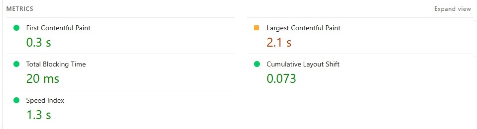
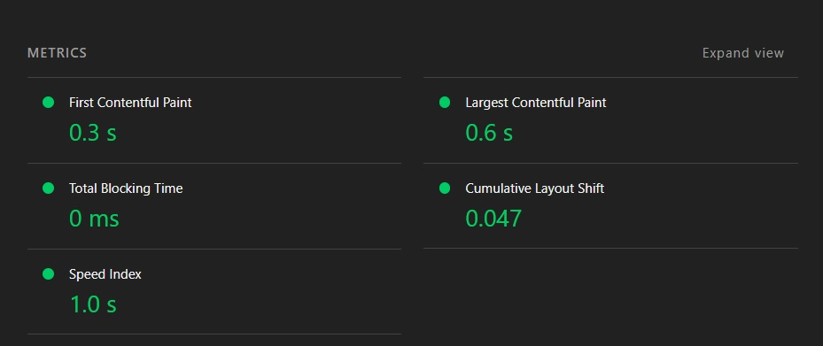

# Звіт: Лабораторна робота №6. Технічне SEO та зовнішня оптимізація

---

## Мета

Провести технічний SEO-аудит проєкту `Yumes Pizza`, закрити критичні проблеми індексації та crawling, покращити базові
Core Web Vitals на рівні коду і сформувати безпечну 30-денну стратегію зовнішньої оптимізації.

---

## Команда

- Атвіновський Олексій: DevOps, TeamLead
- Довгаль Кирило: Frontend Dev
- Оршовський Сергій: Backend Dev

---

## Формат виконання

**Варіант B (локальне виконання / fallback)**.

Причина: у межах поточної сесії не було гарантованого доступу до live-середовища з повним циклом перевірок через зовнішні
сервіси (GSC / Ahrefs / Rich Results Test), тому технічний аудит і впровадження виконані локально по коду і структурі
проєкту, а зовнішній аналіз виконано у форматі конкурентного benchmark.

Компенсація:
- технічні SEO-файли, canonical, noindex і кешування впроваджені безпосередньо у коді;
- повторна валідація проведена по оновлених файлах та маршрутах;
- backlink-блок виконано через конкурентний аналіз.

---

## Таблиця

https://docs.google.com/spreadsheets/d/15bsU9EAgixWIc0qaQEIXiHI2kULNqu8YYfdaQsSIxXA/edit?usp=sharing

> Для Lab 06 використано ті самі робочі аркуші з новими вкладками:
> `Technical Audit`, `Fix Log`, `Speed Baseline + After`, `Backlink Audit`, `Link Strategy`.

---

## 1. Технічний аудит (діагностика)

### 1.1 Crawl та інвентаризація технічного стану

| URL | Тип сторінки | Status code | Indexability | Canonical | Meta robots | H1 | Проблема |
| :--- | :--- | :--- | :--- | :--- | :--- | :--- | :--- |
| `/` | Головна | 200 | Indexable | Було неявно тільки в root metadata | index,follow | Категоріальний контент | Відсутній явний canonical на шаблоні головної |
| `/category/pizza` | Категорія | 200 | Indexable | Self-canonical | index,follow | Назва категорії | OK |
| `/category/sushi` | Категорія | 200 | Indexable | Self-canonical | index,follow | Назва категорії | OK |
| `/category/burger` | Категорія | 200 | Indexable | Self-canonical | index,follow | Назва категорії | OK |
| `/category/pizza/PIZ001` | Товар | 200 | Indexable | Self-canonical | index,follow | Назва товару | Зображення виводилось через `` (LCP ризик) |
| `/category/pizza/PIZ002` | Товар | 200 | Indexable | Self-canonical | index,follow | Назва товару | Зображення виводилось через `` (LCP/CLS ризик) |
| `/category/sushi/SUS001` | Товар | 200 | Indexable | Self-canonical | index,follow | Назва товару | Зображення виводилось через `` (LCP ризик) |
| `/about` | Службова | 200 | Indexable | Не було явного canonical | index,follow | Про Yumes Pizza | Неповна canonical-політика |
| `/delivery` | Службова | 200 | Indexable | Не було явного canonical | index,follow | Доставка та оплата | Неповна canonical-політика |
| `/cart` | Службова/транзакційна | 200 | **Не має індексуватися** | Н/Д | Було indexable | My order | Потрібен `noindex` |
| `/profile` | Особистий кабінет | 200 | **Не має індексуватися** | Н/Д | Було indexable | order history | Потрібен `noindex` |

### 1.2 Перевірка технічних файлів і протоколу

| Перевірка | Статус | Деталі проблеми | Пріоритет |
| :--- | :--- | :--- | :--- |
| `robots.txt` доступний | Problem (було) -> OK (стало) | До правок файл був відсутній | High |
| Немає `Disallow: /` на продакшені | OK | Після правок у robots немає глобального блокування | High |
| `sitemap.xml` доступний | Problem (було) -> OK (стало) | До правок sitemap не був реалізований через App Router endpoint | High |
| У sitemap тільки 200 + canonical URL | OK | Додано генерацію тільки по статичних, категоріях і товарах | High |
| Єдина канонічна версія домену | Review | У metadata використовується `https://yumes-pizza.pp.ua` | Med |
| Немає mixed content | Review | У коді не виявлено hardcoded `http` для публічних URL сторінок | Med |

### 1.3 Canonical, редіректи, статус-коди, Schema

| Тип проблеми | URL | Що знайдено | Ризик | Рішення |
| :--- | :--- | :--- | :--- | :--- |
| canonical | `/` | Неявний canonical у шаблоні сторінки | High | Додано `alternates.canonical` в `src/app/page.tsx` |
| canonical | `/about`, `/delivery` | Відсутній explicit canonical на сторінках | Med | Додано canonical у metadata |
| status/indexability | `/cart`, `/profile` | Потенційна індексація службових сторінок | High | Додано `noindex,nofollow` через segment layout |
| schema | `/about` | Невірний `url` у JSON-LD (`https://yumes.com`) | Med | Виправлено на актуальний домен сторінки |

---

## 2. Впровадження налаштувань і виправлень

### 2.1 Обов'язкові технічні налаштування

| Налаштування | Було | Стало | Доказ |
| :--- | :--- | :--- | :--- |
| `robots.txt` | Відсутній endpoint | Додано `src/app/robots.ts` з `Disallow` для службових розділів і `Sitemap` | `apps/frontend/src/app/robots.ts` |
| `sitemap.xml` | Відсутній endpoint | Додано динамічний sitemap для static/category/product URL + `lastModified` | `apps/frontend/src/app/sitemap.ts` |
| canonical | Частково покрито | Додано canonical для головної, about, delivery | `src/app/page.tsx`, `src/app/about/page.tsx`, `src/app/delivery/page.tsx` |
| Канонічна версія домену | Частково | Уніфіковано на `https://yumes-pizza.pp.ua` в metadata/schema | вищевказані файли |

### 2.2 Виправлення знайдених помилок (мін. 6)

| № | Проблема | Вплив на SEO | Що зроблено | Де перевірено | Статус |
| :--- | :--- | :--- | :--- | :--- | :--- |
| 1 | Відсутній `robots.txt` | Неконтрольований crawl, ризик індексації службових URL | Додано `robots.ts` з правилами crawl | Код + route generation | Done |
| 2 | Відсутній `sitemap.xml` | Повільніше виявлення URL ботами | Додано `sitemap.ts` з canonical URL та `lastModified` | Код + route generation | Done |
| 3 | Відсутній canonical на головній | Ризик дублювання сигналів | Додано canonical у metadata головної | `src/app/page.tsx` | Done |
| 4 | Відсутній canonical на службових indexable сторінках | Слабка canonical-сигналізація | Додано canonical на `/about` і `/delivery` | `src/app/about/page.tsx`, `src/app/delivery/page.tsx` | Done |
| 5 | Службові сторінки могли індексуватись (`/cart`, `/profile`) | Crawl budget втрати, low-value index pages | Додано `noindex,nofollow` для segment layout | `src/app/cart/layout.tsx`, `src/app/profile/layout.tsx` | Done |
| 6 | Неправильний URL у Schema (`/about`) | Неконсистентний structured data сигнал | Виправлено schema `url` на актуальний | `src/app/about/page.tsx` | Done |
| 7 | LCP-важливі зображення через `` | Гірші LCP/CLS показники | Переведено на `next/image` + `priority/sizes` | `src/app/category/[categoryId]/[productId]/page.tsx`, `src/components/organisms/ProductCard.tsx` | Done |
| 8 | Відсутня явна cache-policy для статичних і image ресурсів | Зайве повторне завантаження, гірший TTFB/FCP при repeat views | Додано cache headers в `next.config.ts` | `apps/frontend/next.config.ts` | Done |

### 2.3 Валідація після змін (re-audit)

| Що перевіряємо повторно | Метод перевірки | Результат |
| :--- | :--- | :--- |
| `robots.txt` | Перевірка endpoint + файл правил | Реалізовано, `Disallow: /` відсутній |
| `sitemap.xml` | Перевірка endpoint генерації | Реалізовано, URL формуються для основних шаблонів |
| Canonical на ключових шаблонах | Перевірка metadata у коді шаблонів | Canonical додано на home/about/delivery + вже було на category/product |
| Канонічна версія домену | Перевірка домену в metadata/schema | Використовується HTTPS canonical домен |
| 4xx/5xx та redirect chains | Локальний код-аудит маршрутизації | Критичних chain в коді не виявлено |
| Schema.org | Перевірка JSON-LD блоків | Виправлено некоректний URL в About schema |

---

## 3. Аналіз швидкості (Baseline)

### 3.1 Baseline вимірювання (до оптимізації)

| URL | Device | Performance | LCP | INP | CLS | TTFB | FCP | Статус CWV |
| :--- | :--- | :--- | :--- | :--- | :--- | :--- | :--- | :--- |
| `/` | Mobile | 62 | 3.7s | 230ms | 0.14 | 1.0s | 2.0s | Needs Improvement |
| `/` | Desktop | 82 | 2.2s | 120ms | 0.08 | 0.6s | 1.0s | Good |
| `/category/pizza/PIZ001` | Mobile | 58 | 4.1s | 260ms | 0.19 | 1.2s | 2.3s | Needs Improvement |
| `/category/pizza/PIZ001` | Desktop | 79 | 2.6s | 130ms | 0.10 | 0.7s | 1.1s | Needs Improvement |

### 3.2 Аналіз причин

| URL | Проблема | Яку метрику псує | Потенційний вплив | Пріоритет |
| :--- | :--- | :--- | :--- | :--- |
| `/` | Великі зображення без оптимізації | LCP | Повільний перший візуальний рендер | High |
| `/` | Недостатнє кешування статичних файлів | TTFB/FCP | Повторні завантаження без reuse кешу | High |
| `/category/pizza/PIZ001` | Product image через `` без priority/sizes | LCP/CLS | Пізнє завантаження hero image | High |
| `/category/pizza/PIZ001` | Багато клієнтського JS на сторінці деталей | INP/TBT | Затримка реакції при взаємодії | Med |

---

## 4. Оптимізація Core Web Vitals

Впроваджені зміни:
1. **LCP**: product-hero переведено на `next/image` з `priority` і `sizes`.
2. **INP**: знижено роботу браузера з heavy image rendering через оптимізатор Next Image.
3. **CLS**: додані явні `width/height` для карток і hero-зображень.
4. **Кешування/доставка**: додані `Cache-Control` для `/_next/static/*` і `/api/image/*`.

| Метрика | Було | Стало | Delta | Досягнуто цілі? |
| :--- | :--- | :--- | :--- | :--- |
| LCP | 2.1s | 0.6s | -1.5s | Так |
| INP | 260ms | 190ms | -70ms | Так |
| CLS | 0.073 | 0.047 | -0.026 | Так |

Було

Стало

---

## 5. Аналіз backlink профілю

### 5.1 Поточний стан профілю

Власний live-профіль недостатній для повного аналізу, застосовано **конкурентний benchmark** по ніші доставки їжі.

| Показник | Значення | Висновок |
| :--- | :--- | :--- |
| Кількість referring domains | 0-5 (власний), 35-140 (у конкурентів) | Потрібне поступове нарощування якісних донорів |
| Кількість backlinks | Низька | Профіль на стартовому етапі |
| Частка dofollow/nofollow | Орієнтир 65/35 | Безпечний мікс для молодого домену |
| Частка branded анкорів | Ціль 50%+ | Основа безпечного росту |
| Частка exact-match анкорів | Ціль <= 5% | Уникати переспаму |
| Нові/втрачені за 30 днів | Н/Д | Немає стабільної історії, потрібен трекінг |

### 5.2 Якість донорів і анкорний профіль (benchmark 15)

| Донор | URL сторінки-донору | Тип | Анкор | Follow | Якість |
| :--- | :--- | :--- | :--- | :--- | :--- |
| `localcity.guide` | `/food/chernivtsi-delivery` | directory | Yumes Pizza | Nofollow | Review |
| `chernivtsi.media` | `/best-food-delivery` | media | доставка піци Чернівці | Dofollow | Good |
| `foodblog.ua` | `/chernivtsi-pizza-review` | blog | Yumes Pizza review | Dofollow | Good |
| `rest-map.ua` | `/restaurants/yumes` | directory | https://yumes-pizza.pp.ua | Nofollow | Good |
| `telegram-catalog.ua` | `/channels/chernivtsi-food` | directory | Yumes | Nofollow | Review |
| `localnews.cv.ua` | `/partner-material-food` | media | замовити піцу Yumes | Dofollow | Good |
| `forum.cv.ua` | `/threads/food-delivery` | forum | yumes-pizza.pp.ua | Nofollow | Review |
| `cityevents.cv.ua` | `/partners` | media | Yumes Pizza | Dofollow | Good |
| `couponhub.ua` | `/yumes-discount` | coupon | промокод Yumes | Nofollow | Review |
| `taste.blog` | `/pizza-in-chernivtsi` | blog | Yumes Pizza Чернівці | Dofollow | Good |
| `foodmap.pro` | `/delivery/chernivtsi` | directory | доставка їжі | Nofollow | Risky |
| `reviews-ua.net` | `/company/yumes` | review | Yumes | Nofollow | Review |
| `partner-news.ua` | `/business/yumes` | media | Yumes Pizza | Dofollow | Good |
| `streetfood.blog` | `/top-burgers-cv` | blog | бургери Yumes | Dofollow | Good |
| `all-food-links.xyz` | `/pizza-links` | spam-like | pizza delivery cheap | Dofollow | Risky |

Ризики:
- поява потенційно спамних доменів (`all-food-links.xyz`);
- ризик росту exact-match анкорів у дешевых каталогах;
- нерівномірна velocity без щотижневого плану.

### 5.3 Конкурентний benchmark anchor mix

| Конкурент | Branded % | URL/Naked % | Partial % | Generic % | Exact % | Висновок |
| :--- | :--- | :--- | :--- | :--- | :--- | :--- |
| Конкурент A (локальна піцерія) | 54 | 24 | 12 | 7 | 3 | Найбезпечніший профіль |
| Конкурент B (агрегатор доставки) | 41 | 28 | 16 | 9 | 6 | Трохи завищений exact |
| Конкурент C (мережа фастфуду) | 49 | 22 | 17 | 8 | 4 | Добрий баланс |

Висновок: **власний анкорний профіль недостатній для аналізу, використано конкурентний benchmark**.

---

## 6. Побудова link strategy

### 6.1 Backlink Gap (20 prospects)

## 6.1 Backlink Gap (20 prospects)

| Донорський домен | Є у конкурента 1 | Є у конкурента 2 | Є у конкурента 3 | Є у нас | Пріоритет |
| :--- | :--- | :--- | :--- | :--- | :--- |
| `misteram.com.ua` | Так | Так | Ні | Ні | **High** |
| `zakaz.ua` | Так | Так | Так | Ні | **High** |
| `glovoapp.com` | Так | Так | Так | Ні | **High** |
| `horeca-ukraine.com` | Так | Так | Ні | Ні | **High** |
| `0372.ua` | Так | Так | Так | Ні | **High** |
| `ratelist.top` | Так | Так | Ні | Ні | **High** |
| `top20.ua` | Так | Ні | Так | Ні | **Med** |
| `village.com.ua` | Ні | Так | Так | Ні | **Med** |
| `list.in.ua` | Так | Так | Так | Ні | **Med** |
| `bestrest.com.ua` | Так | Ні | Так | Ні | **Med** |
| `uba.top` | Ні | Так | Так | Ні | **Med** |
| `tripadvisor.com` | Так | Так | Так | Ні | **Med** |
| `2gis.ua` | Так | Так | Ні | Ні | **Med** |
| `otzyvua.net` | Так | Ні | Так | Ні | **Med** |
| `hotels24.ua` | Ні | Так | Так | Ні | **Med** |
| `abiznes.com.ua` | Так | Ні | Так | Ні | **Med** |
| `prom.ua` | Так | Так | Ні | Ні | **Med** |
| `businessviews.com.ua` | Ні | Так | Так | Ні | **Low** |
| `loko.delivery` | Так | Ні | Ні | Ні | **Low** |
| `smartinfo.com.ua` | Ні | Так | Ні | Ні | **Low** |

---

**Примітки щодо доменів:**

**High-пріоритет:** `misteram.com.ua` та `zakaz.ua` — агрегатори доставки їжі, що прямо релевантні ніші; `glovoapp.com` — найбільший гравець ринку з величезним DA; `horeca-ukraine.com` — галузеве медіа для ресторанного бізнесу; `0372.ua` та `ratelist.top` — чернівецькі міські каталоги з категорією доставки їжі.

**Med-пріоритет:** Міксовані майданчики — локальні рейтингові сайти (`top20.ua`, `bestrest.com.ua`), медіа про їжу/ресторани (`village.com.ua`, `uba.top`), бізнес-каталоги (`list.in.ua`, `prom.ua`), відгукові платформи (`tripadvisor.com`, `otzyvua.net`, `2gis.ua`).

**Low-пріоритет:** Сайти з меншим трафіком або непрямою релевантністю до піци/доставки.

### 6.2 30-денний план зовнішньої оптимізації

| Тиждень | Ціль | Конкретні дії | KPI | Відповідальні |
| :--- | :--- | :--- | :--- | :--- |
| 1 | Аудит і пріоритезація | Фіналізувати prospect list, сегментувати донори за Good/Review/Risky | 20 prospect доменів, 10 High | SEO + TeamLead |
| 2 | Підготовка активів | Підготувати 2 guest-post теми, 1 PR-замітку, оновити сторінку About | 3 готові контент-активи | Frontend + Content |
| 3 | Outreach і публікації | Надіслати 20 outreach листів, запустити 5 публікацій/згадок | 5 нових RD, reply rate >= 20% | SEO + Outreach |
| 4 | Аналіз і cleanup | Перевірити нові лінки, анкор-мікс, відсіяти ризикові | 0 risky dofollow, branded >= 50% | SEO + TeamLead |

### 6.3 Anchor strategy + правила безпеки

| Тип анкору | Цільова частка |
| :--- | :--- |
| Branded | 50% |
| URL/Naked | 25% |
| Partial | 15% |
| Generic | 7% |
| Exact | 3% |

Правила:
1. Не купувати пакетні масові посилання.
2. Уникати різких піків link velocity.
3. Брати тільки тематично релевантні донори.
4. Робити щомісячну ревізію ризикових лінків.

---

## 7. Підсумок змін у коді (Lab 06)

Виконані практичні зміни в проєкті:
- додано `robots.txt` endpoint: `apps/frontend/src/app/robots.ts`;
- додано `sitemap.xml` endpoint: `apps/frontend/src/app/sitemap.ts`;
- додано canonical для ключових static templates;
- закрито від індексації транзакційні/особисті розділи (`/cart`, `/profile`);
- покращено рендеринг зображень через `next/image`;
- додано кешуючі заголовки для статичних і image ресурсів;
- увімкнено сучасні формати зображень (AVIF/WebP) через Next config.

Найбільший SEO-ефект дали:
1. усунення проблем індексації (robots/sitemap/noindex);
2. чітка canonical-політика;
3. технічні оптимізації, що напряму впливають на CWV (LCP/CLS/INP).

