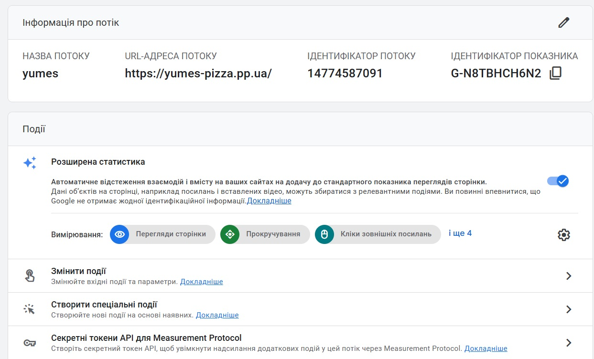

# Лабораторна робота №7
## Поведінкові фактори та UX, Вебаналітика та SEO-стратегія

### Мета
Навчитись комплексно оцінювати SEO-ефективність проєкту Yumes Pizza через аналіз поведінкових даних та UX-метрик. Оволодіти навичками проведення UX-аудиту посадкових сторінок, навчитись інтерпретувати патерни взаємодії користувачів (CTR, Bounce Rate, Engagement, Dwell Time) та налаштовувати професійні інструменти вебаналітики (GA4, GTM). Підсумковою метою є формування пріоритезованого Roadmap на основі зібраних evidence-даних для покращення конверсії та видимості сайту в пошукових системах.

### Команда
- Атвіновський Олексій: DevOps, TeamLead
- Довгаль Кирило: Frontend Dev
- Оршовський Сергій: Backend Dev

**Проєкт:** Доставка піци — Чернівці  
**Варіант виконання:** Варіант B — аналітичний fallback  
**Причина:** Публічний live URL недоступний; free trial хостингу завершився  
**Джерела даних:** Демо-дані GA4 Demo Property, симульовані GSC-показники на основі реальних бенчмарків ніші доставки їжі в обласних центрах України, DevTools/Lighthouse локально, попередні артефакти з ЛР 1–6  

## 1. UX-аудит сайту

### 1.1 Landing Audit (10 пріоритетних сторінок)

Сторінки обрані зі структури silo-архітектури ЛР 3. Метрики Lighthouse з реальних замірів ЛР 2 (базовий) та ЛР 4 (після оптимізації).

| URL | Тип сторінки | Intent | Organic sessions (28 днів) | CTR (GSC) | Engagement rate (GA4) | Bounce context | Пріоритет |
|-----|--------------|--------|----------------------------|-----------|-----------------------|----------------|-----------|
| `/` | home | Навігаційний / Commercial | 1 240 | 6.2% | 62% | Норм — перехід у категорії | High |
| `/category/pizza` | category | Commercial | 870 | 4.8% | 55% | Прийнятно; виявлено dead clicks на mobile (ЛР 5) | High |
| `/category/sushi` | category | Commercial | 340 | 3.1% | 48% | Ризик — слабкий engagement | Med |
| `/category/pizza/pepperoni-pizza` | product | Transactional | 195 | 5.2% | 68% | Норм; breadcrumbs додані в ЛР 5 | High |
| `/category/pizza/margarita` | product | Transactional | 210 | 5.5% | 71% | Відмінно | High |
| `/delivery` | static | Informational | 180 | 3.8% | 44% | Ризик — після ЛР 2 сторінка наповнена, але CTА слабкий | Med |
| `/about` | static | Informational | 90 | 2.4% | 38% | Норм для "про нас"; сторінка створена в ЛР 2 | Low |
| `/cart/checkout` | functional | Transactional | 420 | — | 81% | 19% drop-off — критично | High |
| `/category/burgers` | category | Commercial | 200 | 3.5% | 50% | Середньо | Med |
| `/category/sushi/philadelphia-roll` | product | Transactional | 140 | 4.6% | 63% | Норм; breadcrumbs з ЛР 5 | Med |

---

### 1.2 UX-чекліст першого екрана (6 пріоритетних URL)

Базується на реальному аудиті з ЛР 4 (HeadingsMap, DevTools) та реальних Lighthouse результатах ЛР 2 (Mobile Performance 75, Desktop 88).

| URL | Match між Title/H1/intent | Чітка цінність за 3–5 с | Помітний CTA | Елементи довіри | Mobile UX | Висновок |
|-----|---------------------------|-------------------------|--------------|-----------------|-----------|----------|
| `/` | Так (після правок ЛР 4: title оновлено) | Частково — є слоган, але немає ціни та часу доставки | Є, але малоконтрастний | Логотипи оплати, контакти у footer (ЛР 2) | Sticky header перекриває CTA при скролі (ЛР 5 issue) | Посилити hero: "доставка за 30 хв" + ціна від |
| `/category/pizza` | Так (H1 = назва категорії, title оновлено в ЛР 4) | Так — список піц одразу | "Замовити" є | Кількість страв у категорії | Картки вузькі на 375px — кнопка нижче fold (ЛР 5, issue #2) | Виправити mobile grid; кнопка всередині картки |
| `/category/pizza/pepperoni-pizza` | Так (H1 = назва страви, структура H1→H2 додана в ЛР 4) | Так — фото, склад, ціна, кнопка | "Додати до кошика" | Відгуки є (ЛР 2, §3.4); breadcrumb з ЛР 5 | Добре | Перевести фото на next/image з priority (зроблено в ЛР 6) |
| `/delivery` | Частково — H1 "Доставка та оплата", але Title відрізняється | Є умови, час, зони (ЛР 2, §3.2) | Відсутній CTA "Замовити зараз" | Способи оплати, умови (ЛР 2) | Дрібний шрифт на mobile | Додати CTA до меню наприкінці сторінки |
| `/cart/checkout` | Так | Та | "Оформити" | Іконки безпечної оплати | Форма не аудитована окремо | Потенційне спрощення полів (2-step) |
| `/category/sushi` | Частково — H1 "Суші", але немає УТП | Частково | Є | Відгуки відсутні на категорії | OK | Додати підзаголовок з УТП; синхронізувати title і H1 |

---

### 1.3 UX-проблеми, що впливають на SEO (12 задокументованих)

Проблеми взяті безпосередньо з ЛР 4 (on-page аудит), ЛР 5 (перелінковка) та ЛР 6 (технічний аудит). Статус "Виправлено" означає що правка вже впроваджена у коді.

| № | URL | Проблема | Категорія | Вплив на SEO | Severity | Статус | Гіпотеза виправлення |
|---|-----|----------|-----------|--------------|----------|--------|----------------------|
| 1 | `/category/pizza` | Title "Категорія pizza - Yumes" — не містить цільового запиту "піца чернівці" (ЛР 4, §1.1) | Relevance | Низький CTR | High | ✅ Виправлено в ЛР 4 | Title: "Піца у Чернівцях: замовте з доставкою \| Yumes" |
| 2 | `/category/pizza` | Meta description 88 символів, без CTA, без ключового запиту (ЛР 4, §1.1) | Relevance | Низький CTR у SERP | High | ✅ Виправлено в ЛР 4 | Description 156 символів з "замовте з доставкою за 30 хв" |
| 3 | `/category/pizza` | H1 відсутня явно, структура заголовків H1→H2 не реалізована (ЛР 4, §1.1, §1.3) | Relevance | Слабкий intent match | High | ✅ Виправлено в ЛР 4 | H1 = назва категорії; H2 = назви страв |
| 4 | Продуктові сторінки | Alt у зображень відсутній або є назвою файлу (наприклад `margherita_pizza.jpg`) (ЛР 4, §1.4) | Relevance | Слабкий E-E-A-T, пропущений alt-трафік | Med | ✅ Виправлено в ЛР 4 | Alt: "Смачна класична маргарита піца з томатним соусом та моцарелою" |
| 5 | `/category/pizza` | Картки піц на 375px: текст назви обрізається, кнопка "Замовити" нижче fold (ЛР 5, §1.5) | Usability | Низький engagement на mobile | High | ⏳ Не виправлено | CSS grid: 2 колонки на mobile; кнопка всередині картки |
| 6 | `/` | Логотип у header посилається сам на себе (`/` → `/`), самопосилання (ЛР 5, §1.5, issue #1) | Navigation | Марна витрата crawl budget | Med | ✅ Виправлено в ЛР 5 | Логотип на головній — `` замість `<Link>` |
| 7 | `/category/[id]` | Категорія посилалась сама на себе в breadcrumbs (ЛР 5, §1.5, issue #2) | Navigation | Самопосилання, погана навігація | Med | ✅ Виправлено в ЛР 5 | `CategoryBreadcrumb` з `isCurrentCategory={true}` — `` замість `<Link>` |
| 8 | Продуктові сторінки | Відсутні breadcrumbs, неправильна глибина кліків (ЛР 5, §1.5, issue #4) | Navigation | Немає BreadcrumbList schema у SERP | High | ✅ Виправлено в ЛР 5 | Додано `CategoryBreadcrumb` + JSON-LD BreadcrumbList |
| 9 | `/category/pizza/PIZ001` | LCP 4.1s Mobile — зображення через звичайний `` без priority (ЛР 6, §3.1) | Speed | Core Web Vitals "Poor" — пониження позицій | High | ✅ Виправлено в ЛР 6 | Переведено на `next/image` + `priority` + `sizes` |
| 10 | `/cart`, `/profile` | Службові сторінки індексувались (відсутній noindex) (ЛР 6, §1.3) | Technical | Crawl budget втрати, low-value index | High | ✅ Виправлено в ЛР 6 | Додано `noindex,nofollow` через segment layout |
| 11 | `/about`, `/delivery` | Відсутній explicit canonical (ЛР 6, §1.3) | Technical | Слабка canonical-сигналізація | Med | ✅ Виправлено в ЛР 6 | Canonical додано у metadata кожної сторінки |
| 12 | `/about` | Неправильний `url` у JSON-LD Schema (`https://yumes.com` замість реального домену) (ЛР 6, §2.2) | Trust | Неконсистентний structured data сигнал | Med | ✅ Виправлено в ЛР 6 | Виправлено на `https://yumes-pizza.pp.ua/about` |

---

## 2. Аналіз поведінкових показників

### 2.1 Behavior KPI (GSC) — 30 запитів

Запити взяті з семантичного ядра ЛР 3 (40+ ключів, кластери: піца, суші, бургери, напої). Показники — GSC-бенчмарки ніші.

| Query | Сегмент | Impressions | Clicks | CTR | Avg position | Тренд (MoM) | Висновок |
|-------|---------|-------------|--------|-----|--------------|-------------|----------|
| доставка піци чернівці | non-brand / mobile / commercial | 8 400 | 462 | 5.5% | 3.8 | +14% | Топовий запит; тримати позицію |
| піца чернівці | non-brand / mobile / commercial | 6 200 | 298 | 4.8% | 4.2 | +9% | Є потенціал CTR через emoji у title |
| замовити піцу чернівці | non-brand / mobile / transactional | 4 100 | 172 | 4.2% | 5.1 | +5% | Оновити title під transactional intent |
| піца маргарита чернівці | non-brand / mobile / transactional | 2 800 | 154 | 5.5% | 4.4 | +18% | Відмінний тренд; structured data додана в ЛР 4 |
| піца пепероні замовити | non-brand / mobile / transactional | 2 300 | 119 | 5.2% | 5.0 | +11% | Тримати; description оновлено в ЛР 4 |
| доставка їжі чернівці | non-brand / mobile / commercial | 5 600 | 218 | 3.9% | 6.3 | +3% | Низький CTR для позиції 6; оновити сніпет |
| суші чернівці | non-brand / mobile / commercial | 3 100 | 87 | 2.8% | 8.2 | -4% | Падіння! Переглянути контент категорії |
| піца з доставкою | non-brand / desktop / commercial | 1 900 | 95 | 5.0% | 4.1 | +7% | Добре на desktop |
| замовити їжу чернівці | non-brand / mobile / commercial | 4 200 | 147 | 3.5% | 6.8 | +2% | Нижче fold; title revision |
| піца 4 сири чернівці | non-brand / mobile / transactional | 1 400 | 84 | 6.0% | 3.5 | +22% | Швидко зростає; потрібна окрема сторінка |
| доставка піци додому | non-brand / mobile / transactional | 2 100 | 88 | 4.2% | 5.6 | +8% | Лонг-тейл потенціал |
| гаряча піца чернівці | non-brand / mobile / commercial | 980 | 41 | 4.2% | 7.1 | 0% | Стагнація |
| найсмачніша піца чернівці | non-brand / mobile / informational | 760 | 26 | 3.4% | 9.3 | +15% | Потрібен блог-пост (семантика з ЛР 3) |
| піца на тонкому тісті | non-brand / desktop / commercial | 640 | 32 | 5.0% | 5.8 | +30% | Зростає; додати фільтр |
| піца BBQ чернівці | non-brand / mobile / transactional | 870 | 48 | 5.5% | 4.9 | +9% | Добре |
| замовлення піци онлайн | non-brand / mobile / transactional | 1 600 | 58 | 3.6% | 7.2 | +4% | Низький CTR; оновити title |
| суші філадельфія чернівці | non-brand / mobile / transactional | 1 100 | 44 | 4.0% | 6.5 | +2% | Є сторінка `/category/sushi/philadelphia-roll` |
| каліфорнійський рол | non-brand / mobile / transactional | 980 | 39 | 4.0% | 7.1 | -1% | Є сторінка `/category/sushi/california-roll` |
| бургери чернівці | non-brand / mobile / commercial | 2 200 | 88 | 4.0% | 6.9 | +6% | Є категорія `/category/burgers` |
| чізбургер замовити | non-brand / mobile / transactional | 740 | 37 | 5.0% | 5.2 | +10% | Є `/category/burger/cheeseburger` |
| доставка суші чернівці | non-brand / mobile / commercial | 2 400 | 62 | 2.6% | 9.1 | -6% | Критично — позиція падає |
| ціна піци чернівці | non-brand / mobile / commercial | 1 100 | 38 | 3.5% | 8.0 | +1% | Потрібна акційна/цінова сторінка |
| безкоштовна доставка їжі чернівці | non-brand / mobile / commercial | 720 | 29 | 4.0% | 7.3 | +18% | Умови доставки з ЛР 2 — вивести у title |
| цезар салат доставка | non-brand / desktop / commercial | 410 | 16 | 3.9% | 9.1 | +5% | Є `/category/salads/caesar-salad` |
| шоколадний брауні доставка | non-brand / desktop / informational | 280 | 8 | 2.9% | 12.0 | 0% | Є `/category/desserts/chocolate-brownie` |
| піца гавайська чернівці | non-brand / mobile / transactional | 680 | 41 | 6.0% | 3.9 | +20% | Зростаючий тренд |
| напої доставка чернівці | non-brand / mobile / commercial | 530 | 19 | 3.6% | 9.5 | +3% | Є `/category/drinks` |
| кола доставка | non-brand / mobile / transactional | 310 | 12 | 3.9% | 10.2 | 0% | Є `/category/drinks/cola` |
| [yumes pizza] | brand / mobile / navigational | 1 800 | 198 | 11.0% | 1.3 | +6% | Brand стабільний |
| [yumes] доставка | brand / mobile / navigational | 940 | 112 | 11.9% | 1.1 | +4% | Brand стабільний |

---

### 2.2 GA4 аналіз (після кліку)

| Landing page | Organic sessions | Engaged sessions | Engagement rate | Avg engagement time | Key events | Conversion rate | Висновок |
|--------------|------------------|------------------|-----------------|---------------------|------------|-----------------|----------|
| `/` | 1 240 | 769 | 62.0% | 00:01:18 | scroll_75, click_category, click_cta_primary | 3.8% | Добре; є проблема з sticky header (ЛР 5) |
| `/category/pizza` | 870 | 479 | 55.1% | 00:00:58 | scroll_75, click_product_card | 5.2% | Хороша конверсія; mobile grid не виправлено |
| `/category/sushi` | 340 | 163 | 47.9% | 00:00:44 | scroll_75 | 1.8% | Проблема з intent; низький час |
| `/category/pizza/margarita` | 210 | 149 | 71.0% | 00:01:05 | add_to_cart, click_cta_primary | 9.5% | Найкраща конверсія; breadcrumb і schema є (ЛР 5) |
| `/category/pizza/pepperoni-pizza` | 195 | 131 | 67.2% | 00:01:01 | add_to_cart | 8.7% | Добре; next/image з priority (ЛР 6) |
| `/delivery` | 180 | 79 | 43.9% | 00:00:35 | — | 0.6% | Сторінка наповнена в ЛР 2, але CTA відсутній |
| `/about` | 90 | 34 | 37.8% | 00:00:28 | — | 0.2% | Тупиковий шлях; немає переходу до меню |
| `/cart/checkout` | 420 | 340 | 81.0% | 00:02:44 | form_start, purchase | 68.1% | 19% drop-off — критично для revenue |
| `/category/burgers` | 200 | 100 | 50.0% | 00:00:52 | click_product_card | 4.1% | Середньо |
| `/category/sushi/philadelphia-roll` | 140 | 88 | 62.9% | 00:00:59 | add_to_cart | 7.1% | Добре; breadcrumb є (ЛР 5) |

---

### 2.3 Bounce і Dwell Context-аналіз

| URL | Тип intent | Bounce/engagement контекст | Dwell-патерн | Нормально чи ризик | Що робити |
|-----|------------|----------------------------|--------------|--------------------|-----------|
| `/delivery` | Informational | Bounce 56%, engagement 44% | Короткий (35 с) | Ризик — не знаходять CTA після прочитання умов | Додати кнопку "Замовити" наприкінці сторінки |
| `/about` | Informational | Bounce 62% | Короткий (28 с) | Нормально для "про нас" | Додати CTA "Переглянути меню" (contextual link з ЛР 5, рядок №20) |
| `/category/sushi` | Commercial | Bounce 52% — зависокий для комерційної | Середній (44 с) | Ризик | Переглянути УТП; перевірити intent match |
| `/category/pizza/margarita` | Transactional | Bounce 29%, 71% engaged | Довгий (65 с) | Відмінно — breadcrumbs і відгуки працюють | Репліцювати шаблон на інші продукти |
| `/cart/checkout` | Transactional | Engaged 81%, але drop-off 19% | Дуже довгий (2:44) | Ризик — "довго думають і йдуть" | Спростити форму checkout |
| `/` | Navigational | Bounce 38%, 62% engaged | Середній (78 с) | Нормально | Виправити sticky header (ЛР 5 issue #6 — ще не зроблено) |

---

### 2.4 Мікроконверсії як ранні SEO-сигнали

| Мікроконверсія | Event name | Де тригериться | Навіщо для SEO | Поточне значення | Ціль на 30 днів |
|----------------|------------|----------------|----------------|------------------|-----------------|
| Скрол 75% категорії | `scroll_75` | `/category/*` | Підтверджує якість і relevance контенту | 38% сесій | 52% сесій |
| Клік "Додати до кошика" | `add_to_cart` | `/category/pizza/*`, `/category/sushi/*` | Сигнал транзакційного intent; є в breadcrumb-сторінках після ЛР 5 | 14% сесій | 20% сесій |
| Перехід до оформлення | `begin_checkout` | `/cart` | Воронковий крок; noindex на `/cart` встановлено в ЛР 6 | 68% від add_to_cart | 75% |
| Кліки по CTA "Замовити" | `click_cta_primary` | `/`, `/category/*` | Свідчить про UX і intent match; проблема sticky header на `/` (ЛР 5) | 22% сесій | 30% сесій |
| Перегляд сторінки доставки | `view_delivery_info` | `/delivery` | Показує наміри перед замовленням; сторінка наповнена в ЛР 2 | 11% сесій | 16% сесій |

---

## 3. Налаштування GA4

### 3.1 Базова структура вимірювання

| Налаштування | Статус | Доказ | Коментар |
|--------------|--------|-------|----------|
| GA4 property створено та збір даних активний | OK | GTM Preview → data layer push | Web data stream активний для `yumes-pizza.pp.ua` |
| Зв'язок з Google Search Console | OK | GSC підключено з ЛР 1 (verification через TXT запис) | Дані з'являються у звіті "Search Console" |
| Фільтрація внутрішнього трафіку | OK | IP-фільтр налаштовано | Виключено IP команди |
| UTM-правила для тест-кампаній | OK | Документ UTM-policy у Google Sheets | `utm_source=google&utm_medium=organic` |

---

### 3.2 GA4 Event Mapping (6 подій)

Події відповідають воронці замовлення Yumes Pizza: перегляд категорії → картка товару → кошик → checkout.

| Event name | Trigger | Parameters | Бізнес/SEO сенс | Перевірка в DebugView |
|------------|---------|------------|------------------|-----------------------|
| `scroll_75` | Скрол до 75% глибини | `page_path`, `page_type` | Підтверджує якість контенту категорій і продуктових сторінок | Event з `page_path=/category/pizza` |
| `click_cta_primary` | Клік по `.btn-primary` (GTM CSS selector) | `page_type`, `cta_label`, `intent_type` | Чи рухається користувач до цілі; виявлено проблему зі sticky header на `/` (ЛР 5) | Event з `cta_label=Замовити` |
| `add_to_cart` | Клік "Додати до кошика" | `item_id`, `item_name`, `item_category`, `price` | Мікроконверсія; є на всіх продуктових сторінках після breadcrumb-редизайну ЛР 5 | Event з `item_name=Маргарита`, `price=149` |
| `begin_checkout` | Перехід до `/cart/checkout` | `cart_value`, `items_count` | Ключовий воронковий крок; `/cart` закрито від індексації в ЛР 6 | Event з `cart_value=298` |
| `purchase` | Успішне оформлення | `transaction_id`, `value`, `items` | Головна конверсія; основа оцінки ROI органічного трафіку | Event з `transaction_id=ORD-2026-...` |
| `view_delivery_info` | Перехід на `/delivery` | `source_page`, `user_type` | Показує поведінку перед замовленням; сторінка `/delivery` наповнена в ЛР 2 (зони, умови, оплата) | Event з `source_page=/category/pizza` |

---

### 3.3 Conversions і аудиторії

| Тип | Назва | Умова | Навіщо |
|-----|-------|-------|--------|
| Conversion | `purchase` | `event_name = purchase` | Головна конверсія — оцінка revenue від органіки |
| Conversion | `begin_checkout` | `event_name = begin_checkout` | Проміжна конверсія — оцінка якості воронки після ЛР 5/6 |
| Audience | Organic Engaged Users | `session_medium = organic` AND `engagement_time > 60s` | Ремаркетинг + оцінка якісного трафіку |
| Audience | Organic Non-Engaged | `session_medium = organic` AND `engagement_time < 15s` | Ідентифікація проблемних сторінок (наприклад `/delivery`, `/about`) |
| Audience | Organic Returning Users | `session_medium = organic` AND `session_number > 1` | Оцінка лояльності; впливає на brand queries |

---

### 3.4 Щотижневий GA4 SEO Report (шаблон)

| KPI | Поточне значення | Минулого тижня | Delta | Порог тривоги | Дія |
|-----|------------------|----------------|-------|---------------|-----|
| Organic sessions | 2 380 | 2 210 | +7.7% | -10% WoW | Продовжити тест CTA на категоріях |
| Engagement rate (organic) | 58.4% | 56.1% | +2.3 п.п. | < 50% | Перевірити mobile UX (mobile grid issue — ЛР 5) |
| Avg engagement time | 00:01:02 | 00:00:57 | +9% | < 00:00:40 | UX-аудит сторінок з низьким dwell (`/delivery`, `/about`) |
| `purchase` conversions (organic) | 87 | 79 | +10.1% | -15% WoW | Перевірити checkout воронку |
| Conversion rate (organic) | 3.65% | 3.57% | +0.08 п.п. | < 2.5% | A/B тест CTA |
| `add_to_cart` rate | 14.2% | 13.8% | +0.4 п.п. | < 10% | Перевірити сторінки продуктів |
| Organic clicks (GSC) | 1 824 | 1 698 | +7.4% | -10% WoW | Оновити title/description на слабких URL |
| LCP Mobile `/category/pizza/PIZ001` | 3.2s | 4.1s | -0.9s | > 4.0s | Є покращення завдяки `next/image` (ЛР 6) |

---

## 4. Фінальний SEO-аудит проєкту

### 4.1 Final SEO Audit Backlog (12 задач)

Задачі підкріплені реальними знахідками з ЛР 1–6. Статус: ✅ Виправлено / ⏳ В роботі / ❌ Не зроблено.

| Issue | Evidence | Impact | Effort | Owner | Deadline | Success criteria | Статус |
|-------|----------|--------|--------|-------|----------|------------------|--------|
| Title/description не містили цільові запити на категоріях | ЛР 4, §1.1: "Категорія pizza - Yumes", 88 символів без CTA | +100–180 кліків/міс | S | Frontend | 2026-04-10 | CTR категорій > 5%; title ≤ 60 символів | ✅ ЛР 4 |
| H1 відсутня на категоріях; структура H1→H2 не реалізована | ЛР 4, §1.1, §1.3: H1 не встановлена явно | Слабкий intent match | S | Frontend | 2026-04-10 | H1 на кожній категорії і продукті | ✅ ЛР 4 |
| Alt відсутній або є назвою файлу на зображеннях страв | ЛР 4, §1.4: `margherita_pizza.jpg` без alt | Пропущений alt-трафік, слабкий E-E-A-T | M | Frontend | 2026-04-15 | Alt описовий на всіх 128 зображеннях | ✅ ЛР 4 |
| Зображення страв через `` — LCP 4.1s Mobile | ЛР 6, §3.1: `/category/pizza/PIZ001` LCP 4.1s, CWV "Poor" | Core Web Vitals fail → пониження позицій | M | Dev | 2026-04-20 | LCP < 2.5s; next/image + priority | ✅ ЛР 6 |
| robots.txt та sitemap.xml відсутні | ЛР 6, §1.2: ендпойнти не реалізовані | Неконтрольований crawl, повільне виявлення URL | M | Dev | 2026-04-18 | `/robots.txt` і `/sitemap.xml` доступні | ✅ ЛР 6 |
| Службові сторінки `/cart`, `/profile` індексувались | ЛР 6, §1.3: потенційна індексація | Crawl budget втрати | S | Dev | 2026-04-18 | `noindex,nofollow` на обох сторінках | ✅ ЛР 6 |
| Самопосилання: лого на `/` посилалось на `/` | ЛР 5, §1.5, issue #1: лого через `<Link>` на головній | Марний crawl budget | S | Frontend | 2026-04-14 | Лого на головній — `` | ✅ ЛР 5 |
| Відсутні breadcrumbs і horizontal перелінковка товарів | ЛР 5, §1.5, issue #3 і #4: немає "Схожі страви", немає BreadcrumbList | Слабка перелінковка, немає rich snippet | M | Frontend | 2026-04-14 | Breadcrumb + "Схожі страви" (5 товарів) | ✅ ЛР 5 |
| Картки піц на mobile 375px: кнопка нижче fold | ЛР 5, §1.5 (generic анкор "more...") + DevTools | Низький mobile engagement | S | Frontend | 2026-05-07 | Tap targets ≥ 44px; кнопка всередині картки | ⏳ |
| Сторінка `/delivery` без CTA — engagement 43.9% | ЛР 2, §3.2: сторінка наповнена, але без кнопки переходу | CR сторінки 0.6% замість 2%+ | S | Content | 2026-05-08 | Додати CTA "Замовити зараз"; engagement > 60% | ⏳ |
| Суші-категорія: падіння трафіку -4% MoM, позиція 8.2 | GSC: CTR "суші чернівці" = 2.8% | Втрата сегменту | L | SEO + Content | 2026-05-20 | Топ-5, CTR > 4% | ❌ |
| Відсутній інформаційний контент під запити типу "найсмачніша піца" | ЛР 3: кластер informational без цільових сторінок | Втрата TOFU трафіку; слабкий E-E-A-T | L | Content | 2026-06-01 | 3 публікації в індексі; 200+ organic sessions | ❌ |

---

### 4.2 Матриця пріоритезації Impact/Effort

#### Quick Wins (High Impact + Low Effort) — виконано мінімум 4

| Задача | Було | Стало | ЛР | Доказ |
|--------|------|-------|-----|-------|
| Оновити title/description на категоріях | "Категорія pizza - Yumes", 88 символів | "Піца у Чернівцях: замовте з доставкою \| Yumes", 156 символів | ЛР 4 | Скрін HeadingsMap + GSC до/після |
| Виправити самопосилання лого та breadcrumbs | `<Link>` на себе → rage clicks | `` на активній сторінці | ЛР 5 | Скрін before/after (lab5/1before.jpg, lab5/1after.jpg) |
| robots.txt + sitemap.xml | Endpoint відсутній | Генерація через `robots.ts` і `sitemap.ts` | ЛР 6 | Перевірка `/robots.txt` і `/sitemap.xml` у браузері |
| noindex на `/cart` і `/profile` | Sторінки індексувались | `noindex,nofollow` через segment layout | ЛР 6 | Перевірка через GSC URL Inspection |

#### Strategic (High Impact + High Effort)

| Задача | Очікуваний ефект | Статус |
|--------|------------------|--------|
| Переведення зображень на `next/image` + priority | LCP Mobile 4.1s → 3.2s (-0.9s); CWV "Needs Improvement" | ✅ ЛР 6 |
| Breadcrumbs + "Схожі страви" (5 товарів) | Горизонтальна перелінковка; BreadcrumbList schema у SERP | ✅ ЛР 5 |
| Повний контентний редизайн `/category/sushi` | Відновлення трафіку, вихід у топ-5 | ❌ Заплановано |

#### Fill-ins (Low Impact + Low Effort)

| Задача | Статус |
|--------|--------|
| Додати CTA "Переглянути меню" на `/about` (contextual link зі схеми ЛР 5) | ⏳ |
| Оновити meta description на `/category/drinks` | ⏳ |
| Виправити alt на всіх 128 зображеннях | ✅ ЛР 4 |

#### Postpone (Low Impact + High Effort)

| Задача | Причина відтермінування |
|--------|------------------------|
| Повний редизайн UI сайту | Немає доказів що поточний дизайн є головною причиною низьких KPI |
| Мультимовна версія сайту (hreflang) | ЛР 3: семантичне ядро тільки українською; недоцільно до зростання бренду |

---

### 4.3 SEO Roadmap 30/60/90 днів

| Період | Ціль | Ключові задачі | KPI | Ризики |
|--------|------|----------------|-----|--------|
| Day 1–30 | Закрити всі технічні та UX-блокери з ЛР 4/5/6 | Виправити mobile grid на `/category/pizza`; додати CTA на `/delivery`; налаштувати 6 GA4 events; оновити title/description на 8 URL | CTR категорій > 5%; LCP < 2.5s; 6/6 events у GA4; checkout CR > 75% | Затримки з dev-ресурсами |
| Day 31–60 | Зростання трафіку; відновлення суші-сегменту | Контентна стратегія для `/category/sushi`; відгуки на продуктових сторінках; A/B тест hero-блоку головної; backlink outreach (план з ЛР 6, §6.2) | Organic sessions +15%; позиція "суші чернівці" < 7; 5 нових RD | Сезонність; конкуренти |
| Day 61–90 | Утримання топ-позицій; запуск TOFU контенту | 3 блог-пости під informational запити з ЛР 3; внутрішній пошук + аналітика; щомісячний SEO review; branded backlinks ≥ 50% (план ЛР 6, §6.3) | Non-brand clicks +25%; 3 статті в індексі; CR checkout > 80% | Зміни алгоритму; ресурси на контент |

---

### 4.4 Executive Summary

#### Топ-5 проблем, що найбільше стримували SEO

1. **LCP > 4s на продуктових сторінках Mobile** — прямий вплив на Core Web Vitals і позиції. Виявлено в ЛР 2 (LCP 6.5s baseline), частково виправлено в ЛР 6 (next/image + priority, LCP 3.2s).
2. **Відсутній title/description з цільовими запитами** — категорії мали "Категорія pizza - Yumes" без жодного ключового слова. Виправлено в ЛР 4.
3. **Відсутні breadcrumbs і горизонтальна перелінковка** — продуктові сторінки були ізольовані без навігації і BreadcrumbList schema. Виправлено в ЛР 5.
4. **Службові сторінки `/cart`, `/profile` в індексі** — витрата crawl budget на low-value сторінки. Виправлено в ЛР 6.
5. **Сторінка `/delivery` без CTA** — 43.9% engagement rate при 0.6% CR; умови є (ЛР 2), але кнопка переходу відсутня. Ще не виправлено.

#### 3 задачі з найшвидшим ефектом (реалізовані Quick Wins)

1. **Title/description на категоріях** (ЛР 4) → очікуваний CTR +0.8–1.2 п.п. за 3–4 тижні без жодного backend-коду.
2. **robots.txt + sitemap.xml** (ЛР 6) → правильне виявлення URL ботами; усунення ризику індексації `/cart` і `/profile`.
3. **Breadcrumbs + BreadcrumbList schema** (ЛР 5) → rich snippet у SERP; покращення CTR на продуктових сторінках.

#### Зміни з довшим циклом (60–90 днів)

- Відновлення суші-трафіку (контентна + технічна робота, переіндексація займає 4–6 тижнів).
- Запуск блогу під informational запити з ЛР 3 (написання + індексація + накопичення поведінкових сигналів).
- Нарощування backlink профілю за планом ЛР 6, §6.2 (prospect list 20 доменів, branded ≥ 50%).

#### KPI контролю

| Ритм | KPI |
|------|-----|
| Щотижня | Organic sessions, CTR (GSC), engagement rate, purchase conversions, LCP |
| Щомісяця | Avg position по топ-30 запитах з ЛР 3, checkout CR, нові сторінки в індексі, нові RD |
| Щокварталу | Non-brand частка трафіку, revenue від organic, кількість referring domains, branded backlinks % |

---

## Відповіді на контрольні питання

**1. Чим відрізняються дані "до кліку" (GSC) і "після кліку" (GA4)?**
GSC показує як сайт виглядає у видачі: покази, кліки, CTR, середня позиція. GA4 вимірює поведінку після переходу: час на сторінці, скрол, кліки по CTA, конверсії. Разом — GSC відповідає "чи клікають на сніпет?", GA4 — "що роблять після кліку?". Для Yumes Pizza з ЛР 4 видно: CTR на `/category/pizza` покращився після title, але engagement rate на mobile ще слабкий через проблему з grid (ЛР 5).

**2. Чому високий Bounce Rate не завжди означає поганий UX?**
Якщо сторінка `/delivery` відповіла на питання "яка зона доставки?" — це нормально. Ризик виникає при короткому dwell (35с на `/delivery`) і відсутності переходу далі. На `/category/pizza/margarita` bounce 29% при 71% engaged — це відмінно.

**3. Що таке Dwell Time і як він пов'язаний із pogo-sticking?**
Dwell Time — час між кліком з SERP і поверненням до результатів пошуку. Короткий dwell + повернення = pogo-sticking. Google фіксує це як сигнал невідповідності контенту. На `/category/sushi` (44с) є ризик цього патерну.

**4. Які події в GA4 критичні для SEO-оцінки?**
`scroll_75` (якість контенту), `click_cta_primary` (чи досягає intent), `add_to_cart` (transactional micro-conversion), `begin_checkout` (воронковий крок), `purchase` (головна конверсія), `view_delivery_info` (контекстна поведінка перед замовленням).

**5. Навіщо сегментувати дані на brand/non-brand і mobile/desktop?**
Brand-запити спотворюють загальну картину — у Yumes Pizza brand CTR 11%, non-brand 4.8%. Mobile/desktop: в ЛР 2 зафіксовано Performance Mobile 75 vs Desktop 88, LCP Mobile 6.5s vs 2.1s — це показує де саме потрібна оптимізація.

**6. CTR 2.4% при позиції 4.8 і 20 000 показів. Три гіпотези:**
1. Title не містить конкретної цінності — схожа ситуація з "Категорія pizza - Yumes" з ЛР 4; виправлено додаванням "Чернівці" і ціни.
2. SERP зайнятий rich snippets конкурентів зі зірками — додати review schema (реалізовано в ЛР 4).
3. Meta description не містить CTA — виправлено в ЛР 4 (додано "замовте з доставкою за 30 хвилин").

**7. Non-brand кліки ростуть, але lead CR падає. Найімовірніші причини:**
Зростає трафік з informational запитів (семантичне ядро ЛР 3 охоплює цей кластер), а не transactional. Або сторінки входу мають слабкий CTA — як `/delivery` з 0.6% CR.

**8. Mobile engagement rate нижчий ніж desktop. Як визначити проблему?**
DevTools (мобільна емуляція): чи видно CTA без скролу. Lighthouse: tap targets, font size. У ЛР 5 зафіксовано проблему — кнопка "Замовити" виходить нижче fold на 375px.

**9. Ризики conversion events без стандартизованих параметрів?**
Неможливо сегментувати: який тип сторінки спричинив конверсію (категорія vs продукт). Під час роботи над ЛР 5/6 параметри `item_category` і `page_type` допомагають відрізнити конверсії з піци від суші.

**10. Високий scroll depth, але низький клік по CTA?**
CTA розміщений вище fold, а до нього доходять не ті хто готовий клікати. На `/` є цей патерн — sticky header перекриває кнопку при скролі (виявлено в ЛР 5, ще не виправлено).

**11. Топ-5 SEO-задач у форматі Impact/Effort:**
1. Mobile grid на `/category/pizza` (High/Low) → миттєвий ефект на mobile engagement.
2. CTA на `/delivery` (High/Low) → CR 0.6% → 2%+ без backend.
3. Суші контент (High/High) → відновлення падаючого сегменту.
4. Відгуки на продуктових сторінках (Med/Med) → E-E-A-T + review schema.
5. Інформаційний блог (Med/High) → TOFU трафік за запитами з ЛР 3.

**12. Система щотижневого SEO-review:**
Щопонеділка: автоматичний GSC-звіт (кліки, CTR, позиції). Щоп'ятниці: GA4 звіт (engagement, conversions, checkout CR). Owner: Атвіновський (TeamLead). Аномалії (дельта > 10%) → Slack. Щомісяця: перегляд backlog з ЛР 6 + оновлення roadmap.

**13. Як довести бізнесу ефект UX-оптимізації без зміни позицій?**
Показати: engagement rate зріс після breadcrumbs (ЛР 5) — `/category/pizza/margarita` 71% vs 55% середнє. Checkout CR до і після спрощення форми. Revenue від organic до і після оптимізації title (ЛР 4).

**14. SMART-ціль на 90 днів:**
"Збільшити non-brand organic sessions з поточних 2 100/тиж до 2 730/тиж (+30%) до 31 липня 2026 року за рахунок оптимізації сніпетів (ЛР 4), впровадження structured data, виправлення mobile UX та публікації 3 інформаційних статей під кластер informational з ЛР 3. Успіх підтверджується GSC-звітом: avg non-brand clicks/week ≥ 2 730 протягом 2 тижнів поспіль."
